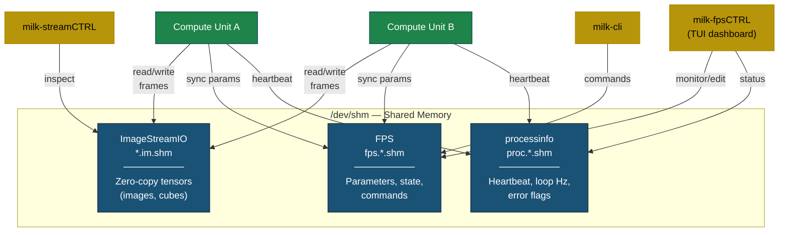
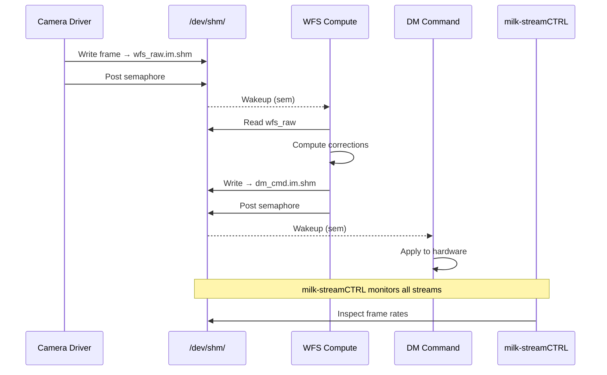
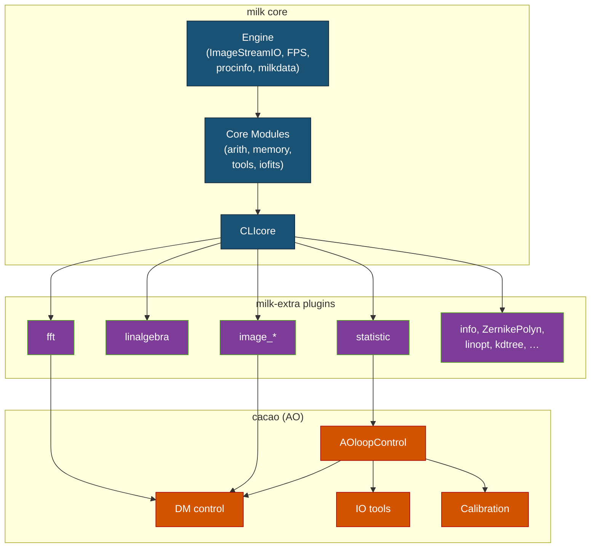

---
tags:
  - architecture
  - core-concepts
---

# Software Architecture

This document presents a hierarchical overview of the
`milk` system architecture. It is the recommended
starting point for programmers who want to understand how
the pieces fit together before diving into code.

See also: [Programmer's Guide](programmers_guide.md) ·
[Dependency Graph](dependency_graph.md)

***

## 1. Purpose

`milk` is a **real-time image-processing framework**
built for Adaptive Optics (AO) and high-performance
scientific computing. It orchestrates many small,
independent compute units that communicate through
zero-copy shared memory, enabling microsecond-latency
data pipelines.

***

## 2. Design Philosophy

| Principle | How it manifests |
|-----------|-----------------|
| **Shared-memory microservices** | Each compute unit is a standalone process; data is exchanged via `/dev/shm/` with no serialization overhead. |
| **Fault isolation** | Every process runs in its own `tmux` session — a crash never brings down the rest of the pipeline. |
| **Live reconfiguration** | Parameters live in shared memory (FPS); any process, CLI, or TUI can change them while the pipeline runs. |
| **Layered build** | The build system is tiered (Engine → Core → Full) so embedded or headless deployments only compile the minimal subset. |

***

## 3. The Three Pillars

All runtime communication in `milk` flows through three
shared-memory subsystems:



| Pillar | Shared Memory Path | Deep-Dive Doc |
|--------|--------------------|---------------|
| **ImageStreamIO** (Streams) | `*.im.shm` | [streams.md](streams.md) |
| **FPS** (Function Processing System) | `fps.*.shm` | [fps.md](fps.md) |
| **processinfo** | `proc.*.shm` | [procinfo.md](procinfo.md) |

***

## 4. Layered Architecture

The codebase is organized in strict dependency layers.
Lower layers have no knowledge of higher ones.

```text
┌──────────────────────────────────────────┐
│            User Interfaces               │
│  milk-cli · milk-fpsCTRL · streamCTRL    │
├──────────────────────────────────────────┤
│            Plugins                       │
│  milk-extra (fft, linalgebra, image*…)   │
│  cacao (AO loop control modules)         │
├──────────────────────────────────────────┤
│            Core Modules                  │
│  COREMOD_arith · COREMOD_memory          │
│  COREMOD_tools · COREMOD_iofits          │
├──────────────────────────────────────────┤
│            Framework                     │
│  CLIcore · milkfpsCLI                    │
│  milkfpsTUI · milkfpsStandalone          │
├──────────────────────────────────────────┤
│            Engine  (POSIX only)          │
│  ImageStreamIO · milkfps                 │
│  milkprocessinfo · milkdata              │
└──────────────────────────────────────────┘
         ▼  External: cfitsio, FFTW, OpenBLAS, CUDA (optional)
```

Each layer corresponds to a **build tier** that can be
compiled independently:

| Tier | CMake Flags | What is built |
|------|-------------|---------------|
| **Engine** | `-DUSE_COREMODS=OFF -DUSE_CLI=OFF` | ImageStreamIO, milkfps, milkdata, milkprocessinfo |
| **Core** | `-DUSE_CLI=OFF -DUSE_CFITSIO=OFF` | Engine + COREMOD arith, memory, tools |
| **Core+FITS** | `-DUSE_CLI=OFF` | Core + COREMOD_iofits |
| **Full** | *(defaults)* | Everything: CLI + all plugins |

→ Details: [Build Tiers](install/build_tiers.md) ·
[Dependency Graph](dependency_graph.md)

***

## 5. Source Tree

```text
milk/
├── src/
│   ├── engine/                        ← Engine tier
│   │   ├── ImageStreamIO/             Zero-copy shared memory streams
│   │   ├── libfps/                    FPS core (parameter management)
│   │   ├── libprocessinfo/            Heartbeat + process tracking
│   │   └── libmilkdata/              IMGID struct, image utilities
│   │
│   ├── cli/                           ← User-facing tools
│   │   ├── CLIcore/                   Interactive shell framework
│   │   └── streamCTRL/               Stream monitor tool
│   │
│   ├── coremods/                      ← Core computation modules
│   │   ├── COREMOD_arith/            Arithmetic operations
│   │   ├── COREMOD_memory/           Memory management
│   │   ├── COREMOD_tools/            Utility functions
│   │   └── COREMOD_iofits/           FITS file I/O (requires cfitsio)
│   │
│   ├── milk_module_example/           ← Template / reference module
│   ├── fpsvalkey/                     Valkey bridge (optional)
│   └── isio-tools/                    Low-level stream utilities
│
├── plugins/
│   ├── milk-extra-src/                ← General-purpose plugins
│   │   ├── fft/                      FFT transforms (FFTW)
│   │   ├── linalgebra/               Linear algebra (OpenBLAS/CUDA)
│   │   ├── linopt_imtools/           Linear optimization
│   │   ├── statistic/                Statistical analysis
│   │   ├── image_gen/                Image generation
│   │   ├── image_basic/              Basic image operations
│   │   ├── image_filter/             Spatial filtering
│   │   ├── image_format/             Format conversions
│   │   ├── info/                     Stream information tools
│   │   ├── ZernikePolyn/             Zernike polynomial basis
│   │   ├── linARfilterPred/          Linear AR predictive filter
│   │   ├── kdtree/                   k-d tree spatial indexing
│   │   ├── img_reduce/               Image frame reduction
│   │   ├── psf/                      PSF analysis
│   │   └── clustering/               Clustering algorithms
│   │
│   └── cacao-src/ → ~/src/cacao       ← AO loop control (symlink)
│       ├── AOloopControl/            Central AO loop engine
│       ├── AOloopControl_DM/         Deformable mirror control
│       ├── AOloopControl_IOtools/    I/O and telemetry
│       ├── AOloopControl_acquireCalib/ Calibration acquisition
│       ├── AOloopControl_PredictiveControl/
│       ├── AOloopControl_compTools/  Computation tools
│       ├── AOloopControl_perfTest/   Performance testing
│       ├── computeCalib/             Calibration computation
│       └── pyramidWFStools/          Pyramid WFS utilities
│
├── scripts/                           ← Shell scripts (milk-*)
├── docs/                              ← Documentation
├── cmake/                             ← CMake helpers
└── _build/                            ← Build output
```

***

## 6. Data Flow

A typical real-time pipeline looks like this:



Each box in this pipeline is an independent process:

- Connected only through shared-memory streams
- Configured via its own FPS instance
- Monitored via processinfo heartbeats
- Running inside a dedicated tmux session

***

## 7. Compute Units (Standalone Executables)

The fundamental building block is the **compute unit** —
a self-contained executable that reads input streams,
applies computation, and writes output streams.

```text
┌─────────────────────────────────────────┐
│         Standalone Executable           │
│         (milk-fpsexec-*)                │
│                                         │
│  ┌─────────────┐  ┌──────────────────┐  │
│  │ FPS Params   │  │ processinfo      │  │
│  │ (shared mem) │  │ (heartbeat)      │  │
│  └──────┬──────┘  └────────┬─────────┘  │
│         │                  │            │
│  ┌──────▼──────────────────▼─────────┐  │
│  │         fpsexec()                 │  │
│  │    (pure computation core)        │  │
│  └──────┬───────────────────┬────────┘  │
│         │                   │           │
│    Read input           Write output    │
│    streams              streams         │
└─────────┼───────────────────┼───────────┘
          ▼                   ▼
    /dev/shm/*.im.shm   /dev/shm/*.im.shm
```

Compute units follow the **V2 8-section layout**
documented in the template
`src/milk_module_example/examplefunc_fps_cli_poc.c`.

They can run in two modes:

- **CLI mode**: loaded as a shared library inside
  `milk-cli`
- **Standalone mode**: independent binary
  (`milk-fpsexec-*`, `cacao-fpsexec-*`)

→ Details:
[Programmer's Guide](programmers_guide.md) ·
[FPS Standalone Modes](FPS_Standalone_CMD_Modes.md)

***

## 8. Plugin System

`milk` uses a plugin architecture where additional
functionality is compiled as shared libraries and loaded
at runtime by `CLIcore`.

### milk-extra plugins

General-purpose libraries for signal processing, linear
algebra, image manipulation, and statistics. Each plugin
registers its CLI commands on load.

### cacao

A domain-specific plugin suite for **Adaptive Optics
loop control**. Source code lives at
`plugins/cacao-src/` (a symlink to `~/src/cacao`).
cacao modules depend on `milk-extra` plugins for FFT,
image processing, and optimization.



→ Details: [Adding Plugins](developer/plugins.md)

***

## 9. User Interfaces

| Tool | Purpose | Interacts with |
|------|---------|----------------|
| `milk-cli` | Interactive shell for running commands, loading modules, scripting pipelines | FPS, Streams |
| `milk-fpsCTRL` | TUI dashboard for monitoring and editing FPS parameters in real time | FPS, processinfo |
| `milk-procCTRL` | TUI for process health monitoring | processinfo |
| `milk-streamCTRL` | TUI for inspecting live stream metadata, frame rates, semaphore state | Streams |
| `milk-fpsexec-*` | Standalone compute executables (one per function) | FPS, Streams, processinfo |
| `milk-fps-*` | CLI utilities for FPS operations (set, list, search, deploy) | FPS |

→ Details: [CLI Overview](cli/CLI_Overview.md) ·
[Scripts Reference](scripts.md)

***

## 10. Multi-Host Operation

For distributed systems, `milk-fps-valkey` bridges local
FPS shared memory to a central
[Valkey](https://valkey.io/) key-value store, enabling
cross-host parameter sync with PubSub notifications.

```text
Host A  ←──►  Valkey Server  ←──►  Host B
(FPS SHM)     (fps:hostA:*)        (FPS SHM)
              (fps:hostB:*)
```

→ Details: [Valkey Integration](valkey.md)

***

## 11. Document Map

| Document | Scope |
|----------|-------|
| **This document** | System-level architecture overview |
| [Programmer's Guide](programmers_guide.md) | Writing compute units, C API, CMake conventions |
| [Dependency Graph](dependency_graph.md) | Library-level build dependencies (mermaid diagrams) |
| [Streams](streams.md) | ImageStreamIO API, IMGID, semaphore model |
| [FPS](fps.md) | Parameter types, fpsCTRL, fpslist.txt workflow |
| [FPS Standalone Modes](FPS_Standalone_CMD_Modes.md) | CMD vs standalone execution contexts |
| [Process Info](procinfo.md) | Heartbeat API, loop profiling |
| [Performance Tuning](performance.md) | CPU pinning, RT scheduling, GPU, network |
| [Debugging](debugging.md) | GDB, tmux logs, common failures |
| [Valkey Integration](valkey.md) | Multi-host parameter sync |
| [Build Tiers](install/build_tiers.md) | Compilation tier configuration |
| [Adding Plugins](developer/plugins.md) | Plugin module creation guide |

***
← [Documentation Index](index.md)
