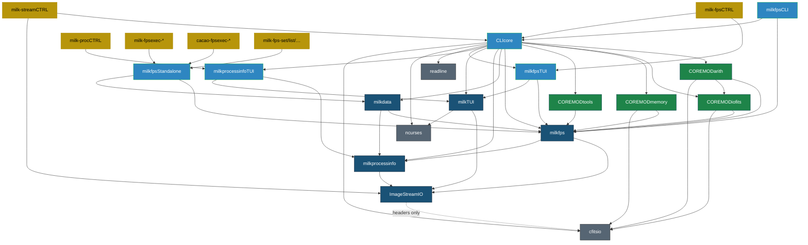
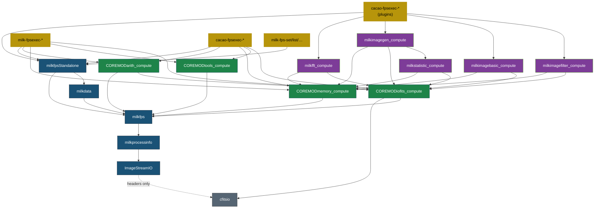

# Milk + Cacao Dependency Graph

> Generated from current CMakeLists.txt — 2026-03-09

---

## Core Stack



## Plugins & Cacao

```mermaid
graph TD
    CLICORE["CLIcore"]:::fw
    OPENBLAS["OpenBLAS"]:::ext
    FFTW["FFTW"]:::ext
    GSL["GSL"]:::ext

    FFT["milkfft"]:::plugin
    LINALG["milklinalgebra"]:::plugin
    LINOPT["milklinoptimtools"]:::plugin
    STAT["milkstatistic"]:::plugin
    IMGGEN["milkimagegen"]:::plugin
    IMGBASIC["milkimagebasic"]:::plugin
    IMGFILT["milkimagefilter"]:::plugin
    IMGFMT["milkimageformat"]:::plugin
    INFO["milkinfo"]:::plugin
    ZERNIKE["milkZernikePolyn"]:::plugin
    LINARPRED["milklinARfilterPred"]:::plugin
    KDTREE["milkkdtree"]:::plugin
    IMREDUCE["milkimgreduce"]:::plugin
    PSF["milkpsf"]:::plugin
    CLUSTER["milkclustering"]:::plugin

    AOLOOP["cacaoAOloopControl"]:::cacao
    AODM["cacaoAOloopControlDM"]:::cacao
    AOIO["cacaoAOloopControlIOtools"]:::cacao
    AOACQ["cacaoAcquireCalib"]:::cacao
    AOPC["cacaoPredictiveControl"]:::cacao
    AOCT["cacaoCompTools"]:::cacao
    AOPT["cacaoPerfTest"]:::cacao
    COMPCALIB["cacaoComputeCalib"]:::cacao
    PYRWFS["cacaoPyramidWFS"]:::cacao

    FFT --> CLICORE
    FFT --> FFTW
    LINALG --> CLICORE
    LINALG --> OPENBLAS
    LINOPT --> CLICORE
    LINOPT --> GSL
    STAT --> CLICORE
    IMGGEN --> CLICORE
    IMGGEN --> STAT
    IMGBASIC --> CLICORE
    IMGFILT --> CLICORE
    IMGFMT --> CLICORE
    IMGFMT -.-> IMGFILT
    INFO --> CLICORE
    ZERNIKE --> CLICORE
    ZERNIKE --> IMGGEN
    LINARPRED --> CLICORE
    LINARPRED --> OPENBLAS
    KDTREE --> CLICORE
    IMREDUCE --> CLICORE
    PSF --> CLICORE
    CLUSTER --> CLICORE

    AOLOOP --> CLICORE
    AOLOOP --> LINOPT
    AODM --> CLICORE
    AODM --> FFT
    AODM --> IMGGEN
    AODM --> IMGFILT
    AODM --> AOLOOP
    AOIO --> CLICORE
    AOIO --> INFO
    AOIO --> AOLOOP
    AOACQ --> CLICORE
    AOACQ --> INFO
    AOACQ --> AOLOOP
    AOPC --> CLICORE
    AOPC --> LINOPT
    AOPC --> AOLOOP
    AOCT --> CLICORE
    AOCT --> AOLOOP
    AOPT --> CLICORE
    AOPT --> STAT
    AOPT --> AOLOOP
    COMPCALIB --> CLICORE
    COMPCALIB --> INFO
    COMPCALIB --> AOLOOP
    COMPCALIB --> OPENBLAS
    PYRWFS --> CLICORE
    PYRWFS --> INFO
    PYRWFS --> AOLOOP

    classDef ext fill:#566573,stroke:#333,color:#fff
    classDef fw fill:#2e86c1,stroke:#1a5,color:#fff
    classDef plugin fill:#7d3c98,stroke:#5a2,color:#fff
    classDef cacao fill:#d35400,stroke:#a00,color:#fff
```



## Standalone Build (USE_CLI=OFF)



### Legend

| Color | Layer |
|---|---|
| ⚫ Grey | External libraries |
| 🔵 Dark blue | Core (ISIO → procinfo → FPS → milkdata) |
| 🔵 Light blue | Framework (CLIcore, fpsCLI/TUI, fpsStandalone) |
| 🟢 Green | COREMODs / _compute variants |
| 🟣 Purple | milk-extra plugins / _compute variants |
| 🟠 Orange | Cacao modules |
| 🟡 Yellow | Executables |

---

## Exhaustive Dependency Table

### Core Libraries

| Target | Links to | Optional |
|---|---|---|
| ImageStreamIO | *(none at link time)* | cfitsio (headers), CUDA |
| milkprocessinfo | ImageStreamIO | |
| milkprocessinfoTUI | milkprocessinfo, milkTUI, ncurses | |
| milkfps | ImageStreamIO, milkprocessinfo | |
| milkdata | ImageStreamIO, milkfps, milkprocessinfo | |
| milkTUI | ImageStreamIO, ncurses | |
| milkfpsStandalone | milkfps, milkdata | |
| milkfpsCLI | milkfps, CLIcore | |
| milkfpsTUI | milkfps, milkTUI, ncurses | |
| CLIcore | milkCOREMODarith, milkCOREMODiofits, milkCOREMODmemory, milkCOREMODtools, milkfps, milkdata, milkprocessinfo, milkTUI, milkfpsTUI, milkprocessinfoTUI, cfitsio, readline, ncurses | OpenMP, hwloc |

### COREMOD Libraries

| Target | Links to |
|---|---|
| milkCOREMODiofits | milkfps, cfitsio |
| milkCOREMODarith | milkfps, milkCOREMODiofits, cfitsio |
| milkCOREMODmemory | milkfps, cfitsio |
| milkCOREMODtools | milkfps |

### COREMOD _compute Variants (MILK_NO_CLI)

| Target | Links to |
|---|---|
| milkCOREMODiofits_compute | milkfps, cfitsio |
| milkCOREMODarith_compute | milkfps, milkCOREMODiofits_compute, cfitsio |
| milkCOREMODmemory_compute | milkfps, cfitsio |
| milkCOREMODtools_compute | milkfps |

### milk-extra Plugins (full / CLI)

| Target | Links to | Optional |
|---|---|---|
| milkfft | CLIcore, fftw3, fftw3f | |
| milklinalgebra | CLIcore, OpenBLAS | CUDA, MAGMA, MKL, lapacke |
| milklinoptimtools | CLIcore | GSL |
| milkimagegen | CLIcore, milkstatistic | |
| milkstatistic | CLIcore | |
| milkimagebasic | CLIcore | |
| milkimagefilter | CLIcore | |
| milkimageformat | CLIcore | |
| milkinfo | CLIcore | |
| milkZernikePolyn | CLIcore, milkimagegen | |
| milklinARfilterPred | CLIcore | OpenBLAS, MKL |
| milkkdtree | CLIcore | |
| milkimgreduce | CLIcore | |
| milkpsf | CLIcore | |
| milkclustering | CLIcore | |

### milk-extra Plugin _compute Variants (MILK_NO_CLI)

| Target | Links to |
|---|---|
| milkfft_compute | fftw3, fftw3f, milkCOREMODmemory_compute, milkCOREMODiofits_compute, cfitsio |
| milkimagebasic_compute | milkCOREMODmemory_compute, milkCOREMODiofits_compute, cfitsio |
| milkimagefilter_compute | milkCOREMODmemory_compute, milkCOREMODiofits_compute, cfitsio |
| milkimagegen_compute | milkstatistic_compute, milkCOREMODmemory_compute, milkCOREMODiofits_compute, cfitsio |
| milkstatistic_compute | milkCOREMODmemory_compute, milkCOREMODiofits_compute, cfitsio, m |

### Cacao Modules

| Target | Links to | Optional |
|---|---|---|
| cacaoAOloopControl | CLIcore, milklinoptimtools | |
| cacaoAOloopControlDM | CLIcore, milkfft, milkimagegen, milkimagefilter, cacaoAOloopControl | |
| cacaoAOloopControlIOtools | CLIcore, milkinfo, cacaoAOloopControl | |
| cacaoAOloopControlacquireCalib | CLIcore, milkinfo, cacaoAOloopControl | |
| cacaoAOloopControlPredCtrl | CLIcore, milklinoptimtools, cacaoAOloopControl | |
| cacaoAOloopControlCompTools | CLIcore, cacaoAOloopControl | |
| cacaoAOloopControlPerfTest | CLIcore, milkstatistic, cacaoAOloopControl | |
| cacaocomputeCalib | CLIcore, milkinfo, cacaoAOloopControl | CUDA, MAGMA, OpenBLAS, MKL, lapacke |
| cacaopyramidWFStools | CLIcore, milkinfo, cacaoAOloopControl | lapacke |

### Executables

| Target | Links to |
|---|---|
| milk-cli | CLIcore + all module libs |
| milk-fpsCTRL | milkfpsTUI, milkfps, milkprocessinfo, ImageStreamIO, CLIcore, ncurses |
| milk-procCTRL | milkprocessinfoTUI |
| milk-streamCTRL | CLIcore, ImageStreamIO |
| milk-fps-list/search/info/rm | milkfps, milkfpsStandalone, milkdata, milkprocessinfo, ImageStreamIO |
| milk-fps-set/track | milkfps, milkfpsStandalone, milkdata, milkprocessinfo, ImageStreamIO |
| milk-fps-conf*/run* | milkfps, milkfpsStandalone, milkdata, milkprocessinfo, ImageStreamIO |
| milk-fps-valkey | milkfps, milkprocessinfo, ImageStreamIO, valkey |
| stream-monproc-runner | milkinfo, CLIcore, ImageStreamIO |
| stream-monproc-disp | milkinfo, CLIcore, ImageStreamIO, ncurses |

### Standalone Executables via CMake Functions

| Function | Base link set |
|---|---|
| `add_milk_standalone()` | milkfps, milkfpsStandalone, milkdata, milkprocessinfo, ImageStreamIO, milkCOREMODmemory_compute, milkCOREMODtools_compute, milkCOREMODarith_compute, milkCOREMODiofits_compute, cfitsio |
| `add_cacao_standalone()` | same as above |
| `add_cacao_standalone_plugins()` | above + selected plugin _compute libs (default: all 4) |

`add_cacao_standalone_plugins()` accepts an optional list of plugins to link:

```cmake
add_cacao_standalone_plugins(name src.c)               # all 4 plugins
add_cacao_standalone_plugins(name src.c fft imagegen)   # selective
```

Valid plugin names: `fft`, `imagegen`, `imagefilter`, `imagebasic`.

> [!NOTE]
> `_compute` library variants are compiled with `MILK_NO_CLI` — they contain pure
> computation code with CLI registration stubs.
>
> Standalone executables do **not** link `${LIBNAME}` by default (which would pull in
> CLIcore). If a standalone needs module-lib symbols, add an explicit
> `target_link_libraries(... PUBLIC ${LIBNAME})` after the `add_*_standalone()` call.
>
> Currently **76 of 90** standalone executables are CLIcore-free. 14 exceptions are
> whitelisted in `milk-check-standalone-deps` (they require module-lib symbols
> for OpenBLAS, FFT, tree algorithms, etc.).

---

## Core Library Chain (Bottom-Up)

```
cfitsio (headers only)
  ╌╌ ImageStreamIO
       └─ milkprocessinfo
            └─ milkfps
                 └─ milkdata
                      ├─ milkfpsStandalone  (standalone path)
                      └─ CLIcore            (full CLI path)
```
