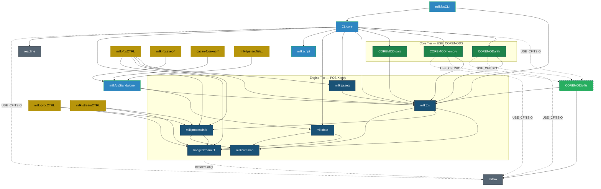
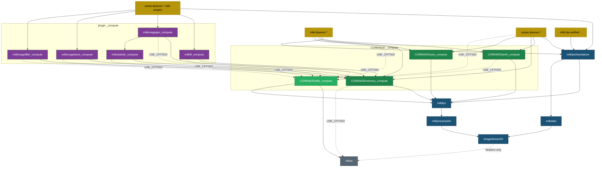

# Dependency Graph

!!! note
Generated from CMakeLists.txt — 2026-05-30. See [Build Tiers](install/build_tiers.md) for cmake
commands.

## Legend

| Color               | Meaning                         |
| ------------------- | ------------------------------- |
| ⚫ Grey             | External library                |
| 🔵 Dark blue        | Engine tier                     |
| 🔵 Light blue       | Framework                       |
| 🟢 Green            | Core modules                    |
| 🟢 Green dashed     | cfitsio-dependent (USE_CFITSIO) |
| 🟣 Purple           | Plugins                         |
| 🟠 Orange           | Cacao modules                   |
| 🟡 Gold             | Executables                     |
| `-.->` dashed arrow | Conditional link                |

---

## 1. Core Stack



---

## 2. Plugins & Cacao

> Only built in the **Full** tier (all defaults ON).

```mermaid
graph TD
    CLICORE["CLIcore"]:::fw
    OPENBLAS["OpenBLAS"]:::ext
    FFTW["FFTW"]:::ext
    GSL["GSL"]:::ext

    subgraph milkplugins ["milk-extra plugins"]
        FFT["milkfft"]:::plugin
        LINALG["milklinalgebra"]:::plugin
        LINOPT["milklinoptimtools"]:::plugin
        STAT["milkstatistic"]:::plugin
        IMGGEN["milkimagegen"]:::plugin
        IMGBASIC["milkimagebasic"]:::plugin
        IMGFILT["milkimagefilter"]:::plugin
        IMGFMT["milkimageformat"]:::plugin
        INFO["milkinfo"]:::plugin
        ZERNIKE["milkZernikePolyn"]:::plugin
        LINARPRED["milklinARfilterPred"]:::plugin
        KDTREE["milkkdtree"]:::plugin
        IMREDUCE["milkimgreduce"]:::plugin
        PSF["milkpsf"]:::plugin
        CLUSTER["milkclustering"]:::plugin
    end

    subgraph cacaomods ["cacao modules"]
        AOLOOP["cacaoAOloopControl"]:::cacao
        AODM["cacaoAOloopControlDM"]:::cacao
        AOIO["cacaoAOloopControlIOtools"]:::cacao
        AOACQ["cacaoAcquireCalib"]:::cacao
        AOPC["cacaoPredictiveControl"]:::cacao
        AOCT["cacaoCompTools"]:::cacao
        AOPT["cacaoPerfTest"]:::cacao
        COMPCALIB["cacaoComputeCalib"]:::cacao
        PYRWFS["cacaoPyramidWFS"]:::cacao
    end

    FFT --> CLICORE
    FFT --> FFTW
    LINALG --> CLICORE
    LINALG --> OPENBLAS
    LINOPT --> CLICORE
    STAT --> CLICORE
    IMGGEN --> CLICORE
    IMGGEN --> STAT
    IMGBASIC --> CLICORE
    IMGFILT --> CLICORE
    IMGFMT --> CLICORE
    IMGFMT -.-> IMGFILT
    INFO --> CLICORE
    ZERNIKE --> CLICORE
    ZERNIKE --> IMGGEN
    LINARPRED --> CLICORE
    LINARPRED --> OPENBLAS
    KDTREE --> CLICORE
    IMREDUCE --> CLICORE
    PSF --> CLICORE
    CLUSTER --> CLICORE

    AOLOOP --> CLICORE
    AOLOOP --> LINOPT
    AODM --> CLICORE
    AODM --> FFT
    AODM --> IMGGEN
    AODM --> IMGFILT
    AODM --> AOLOOP
    AOIO --> CLICORE
    AOIO --> INFO
    AOIO --> AOLOOP
    AOACQ --> CLICORE
    AOACQ --> INFO
    AOACQ --> AOLOOP
    AOPC --> CLICORE
    AOPC --> LINOPT
    AOPC --> AOLOOP
    AOCT --> CLICORE
    AOCT --> AOLOOP
    AOPT --> CLICORE
    AOPT --> STAT
    AOPT --> AOLOOP
    COMPCALIB --> CLICORE
    COMPCALIB --> INFO
    COMPCALIB --> AOLOOP
    COMPCALIB --> OPENBLAS
    PYRWFS --> CLICORE
    PYRWFS --> INFO
    PYRWFS --> AOLOOP

    classDef ext fill:#566573,stroke:#333,color:#fff
    classDef fw fill:#2e86c1,stroke:#1a5,color:#fff
    classDef plugin fill:#7d3c98,stroke:#5a2,color:#fff
    classDef cacao fill:#d35400,stroke:#a00,color:#fff
```



---

## 3. Standalone Build (USE_CLI=OFF)

> Standalone executables use `_compute` library variants (compiled with `MILK_NO_CLI`).



---

## 4. Build Tiers at a Glance

| Tier            | CMake flags                        | What is built                                                             |
| --------------- | ---------------------------------- | ------------------------------------------------------------------------- |
| **Engine**      | `-DUSE_COREMODS=OFF -DUSE_CLI=OFF` | ImageStreamIO, milkcommon, milkprocessinfo, milkfps, milkdata, milkfpsseq |
| **Core**        | `-DUSE_CLI=OFF`                    | Engine + COREMOD arith, memory, tools, iofits                             |
| **Core − FITS** | `-DUSE_CLI=OFF -DUSE_CFITSIO=OFF`  | Engine + COREMOD arith, memory, tools (no iofits)                         |
| **Full**        | _(defaults)_                       | Core + CLI + all plugins                                                  |

```text
cfitsio (headers only, optional)
  ╌╌ ImageStreamIO                    ← Engine
       ├─ milkcommon
       └─ milkprocessinfo
            └─ milkfps
                 ├─ milkdata
                 ├─ milkfpsseq
                 ├─ milkfpsStandalone  (standalone)
                 └─ CLIcore            (full CLI)

COREMOD_arith ─┐
COREMOD_memory ┼─ Core                ← USE_COREMODS
COREMOD_tools ─┘
COREMOD_iofits ── Core (USE_CFITSIO)  ← USE_CFITSIO
```

---

## 5. Detailed Dependency Tables

<details markdown="1">
<summary><b>Engine Tier — Core Libraries</b></summary>

| Target          | Links to                                   | Optional                |
| --------------- | ------------------------------------------ | ----------------------- |
| ImageStreamIO   | _(none at link time)_                      | cfitsio (headers), CUDA |
| milkcommon      | _(none)_                                   |                         |
| milkprocessinfo | ImageStreamIO, milkcommon                  |                         |
| milkfps         | ImageStreamIO, milkprocessinfo, milkcommon |                         |
| milkdata        | ImageStreamIO, milkcommon                  |                         |
| milkfpsseq      | milkfps                                    |                         |

</details>

<details markdown="1">
<summary><b>Framework Libraries</b></summary>

| Target            | Links to                                                                                                        | Optional                                                   |
| ----------------- | --------------------------------------------------------------------------------------------------------------- | ---------------------------------------------------------- |
| milkfpsStandalone | milkfps, milkdata                                                                                               |                                                            |
| milkfpsCLI        | milkfps, CLIcore                                                                                                |                                                            |
| milkscript        | _(see CLIcore)_                                                                                                 |                                                            |
| CLIcore           | COREMODarith, COREMODmemory, COREMODtools, milkfps, milkfpsseq, milkdata, milkprocessinfo, milkscript, readline | COREMODiofits (USE_CFITSIO), cfitsio (USE_CFITSIO), OpenMP |

</details>

<details markdown="1">
<summary><b>Core Tier — COREMOD Libraries</b></summary>

| Target            | Links to         | Conditional                          |
| ----------------- | ---------------- | ------------------------------------ |
| milkCOREMODtools  | milkfps          |                                      |
| milkCOREMODmemory | milkfps          | cfitsio (USE_CFITSIO)                |
| milkCOREMODarith  | milkfps          | COREMODiofits, cfitsio (USE_CFITSIO) |
| milkCOREMODiofits | milkfps, cfitsio | _only built with USE_CFITSIO_        |

**\_compute variants** (compiled with `MILK_NO_CLI`):

| Target                    | Links to         | Conditional                                  |
| ------------------------- | ---------------- | -------------------------------------------- |
| milkCOREMODtools_compute  | milkfps          |                                              |
| milkCOREMODmemory_compute | milkfps          | cfitsio (USE_CFITSIO)                        |
| milkCOREMODarith_compute  | milkfps          | COREMODiofits_compute, cfitsio (USE_CFITSIO) |
| milkCOREMODiofits_compute | milkfps, cfitsio | _only built with USE_CFITSIO_                |

</details>

<details markdown="1">
<summary><b>Full Tier — milk-extra Plugins</b></summary>

| Target              | Links to               | Optional                  |
| ------------------- | ---------------------- | ------------------------- |
| milkfft             | CLIcore, fftw3, fftw3f |                           |
| milklinalgebra      | CLIcore, OpenBLAS      | CUDA, MAGMA, MKL, lapacke |
| milklinoptimtools   | CLIcore                |                           |
| milkimagegen        | CLIcore, milkstatistic |                           |
| milkstatistic       | CLIcore                |                           |
| milkimagebasic      | CLIcore                |                           |
| milkimagefilter     | CLIcore                |                           |
| milkimageformat     | CLIcore                |                           |
| milkinfo            | CLIcore                |                           |
| milkZernikePolyn    | CLIcore, milkimagegen  |                           |
| milklinARfilterPred | CLIcore                | OpenBLAS, MKL             |
| milkkdtree          | CLIcore                |                           |
| milkimgreduce       | CLIcore                |                           |
| milkpsf             | CLIcore                |                           |
| milkclustering      | CLIcore                |                           |

**\_compute variants:**

| Target                      | Links to                                                            |
| --------------------------- | ------------------------------------------------------------------- |
| milkfft_compute             | fftw3, fftw3f, COREMODmemory_compute, COREMODiofits_compute         |
| milkimagebasic_compute      | COREMODmemory_compute, COREMODiofits_compute                        |
| milkimagefilter_compute     | COREMODmemory_compute, COREMODiofits_compute                        |
| milkimagegen_compute        | milkstatistic_compute, COREMODmemory_compute, COREMODiofits_compute |
| milkstatistic_compute       | COREMODmemory_compute, COREMODiofits_compute                        |
| milklinalgebra_compute      | COREMODmemory_compute                                               |
| milklinoptimtools_compute   | COREMODmemory_compute                                               |
| milkZernikePolyn_compute    | COREMODmemory_compute                                               |
| milklinARfilterPred_compute | COREMODmemory_compute, milklinalgebra_compute                       |

</details>

<details markdown="1">
<summary><b>Full Tier — Cacao Modules</b></summary>

| Target                         | Links to                                                            | Optional                            |
| ------------------------------ | ------------------------------------------------------------------- | ----------------------------------- |
| cacaoAOloopControl             | CLIcore, milklinoptimtools                                          |                                     |
| cacaoAOloopControlDM           | CLIcore, milkfft, milkimagegen, milkimagefilter, cacaoAOloopControl |                                     |
| cacaoAOloopControlIOtools      | CLIcore, milkinfo, cacaoAOloopControl                               |                                     |
| cacaoAOloopControlacquireCalib | CLIcore, milkinfo, cacaoAOloopControl                               |                                     |
| cacaoAOloopControlPredCtrl     | CLIcore, milklinoptimtools, cacaoAOloopControl                      |                                     |
| cacaoAOloopControlCompTools    | CLIcore, cacaoAOloopControl                                         |                                     |
| cacaoAOloopControlPerfTest     | CLIcore, milkstatistic, cacaoAOloopControl                          |                                     |
| cacaocomputeCalib              | CLIcore, milkinfo, cacaoAOloopControl                               | CUDA, MAGMA, OpenBLAS, MKL, lapacke |
| cacaopyramidWFStools           | CLIcore, milkinfo, cacaoAOloopControl                               | lapacke                             |

</details>

<details markdown="1">
<summary><b>Executables</b></summary>

| Target                       | Links to                                            |
| ---------------------------- | --------------------------------------------------- |
| milk-cli                     | CLIcore + all module libs                           |
| milk-fpsCTRL                 | milkfpsseq, milkfps, milkprocessinfo, ImageStreamIO |
| milk-procCTRL                | milkprocessinfo, ImageStreamIO                      |
| milk-streamCTRL              | ImageStreamIO, milkprocessinfo                      |
| milk-fps-list/search/info/rm | milkfpsStandalone (transitively: milkfps, milkdata) |
| milk-fps-set/track           | milkfpsStandalone                                   |
| milk-fps-conf*/run*          | milkfpsStandalone                                   |

</details>

<details markdown="1">
<summary><b>Standalone CMake Functions</b></summary>

| Function                         | Base link set                                                                                                                                                              |
| -------------------------------- | -------------------------------------------------------------------------------------------------------------------------------------------------------------------------- |
| `add_milk_standalone()`          | milkfps, milkfpsStandalone, milkfpsseq, milkdata, milkprocessinfo, ImageStreamIO, COREMODmemory_compute, COREMODtools_compute, COREMODarith_compute, COREMODiofits_compute |
| `add_cacao_standalone()`         | same as above                                                                                                                                                              |
| `add_cacao_standalone_plugins()` | above + selected plugin \_compute libs                                                                                                                                     |

```cmake
add_cacao_standalone_plugins(name src.c)               # all 4 plugins
add_cacao_standalone_plugins(name src.c fft imagegen)   # selective
```

Valid plugin names: `fft`, `imagegen`, `imagefilter`, `imagebasic`.

**ℹ️ Note:** `_compute` variants contain pure computation code (`MILK_NO_CLI`). Standalone
executables do **not** link `${LIBNAME}` by default. Currently **76 of 90** standalones are
CLIcore-free.

When `USE_STATIC_LTO=ON`, static archive (`.a`) variants of these libraries are built and linked
instead, enabling cross-module Link-Time Optimization. See [PGO & LTO](pgo.md).

</details>

---

← [Documentation Index](index.md)
