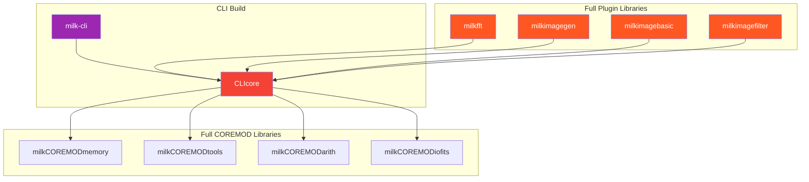

# Dependency Architecture — After Refactoring

## Standalone Executable Dependency Graph

```mermaid
graph TD
    subgraph "Standalone Executables"
        MILK_EXE["milk-fpsexec-*"]
        CACAO_EXE["cacao-fpsexec-*<br/>(base)"]
        CACAO_PLUG["cacao-fpsexec-*<br/>(with plugins)"]
    end

    subgraph "Core Compute Libraries"
        MILKFPS["milkfps"]
        MILKFPS_SA["milkfpsStandalone"]
        MILKDATA["milkdata"]
        PROCINFO["milkprocessinfo"]
        ISIO["ImageStreamIO"]
    end

    subgraph "COREMOD _compute Variants"
        MEM_C["milkCOREMODmemory_compute"]
        TOOLS_C["milkCOREMODtools_compute"]
        ARITH_C["milkCOREMODarith_compute"]
        IOFITS_C["milkCOREMODiofits_compute"]
    end

    subgraph "Plugin _compute Variants"
        FFT_C["milkfft_compute"]
        IMGGEN_C["milkimagegen_compute"]
        IMGBASIC_C["milkimagebasic_compute"]
        IMGFILT_C["milkimagefilter_compute"]
    end

    subgraph "System Libraries"
        CFITSIO["cfitsio"]
        FFTW["fftw3 / fftw3f"]
    end

    MILK_EXE --> MILKFPS & MILKFPS_SA & MILKDATA & PROCINFO & ISIO
    MILK_EXE --> MEM_C & TOOLS_C & ARITH_C & IOFITS_C

    CACAO_EXE --> MILKFPS & MILKFPS_SA & MILKDATA & PROCINFO & ISIO
    CACAO_EXE --> MEM_C & TOOLS_C & ARITH_C & IOFITS_C

    CACAO_PLUG --> FFT_C & IMGGEN_C & IMGBASIC_C & IMGFILT_C
    CACAO_PLUG --> MILKFPS & MILKFPS_SA & MILKDATA & PROCINFO & ISIO
    CACAO_PLUG --> MEM_C & TOOLS_C & ARITH_C & IOFITS_C

    MEM_C & TOOLS_C & ARITH_C & IOFITS_C --> CFITSIO
    FFT_C --> FFTW
    FFT_C & IMGGEN_C & IMGBASIC_C & IMGFILT_C --> MEM_C & IOFITS_C

    style MILK_EXE fill:#4CAF50,color:white
    style CACAO_EXE fill:#4CAF50,color:white
    style CACAO_PLUG fill:#8BC34A,color:white
    style FFT_C fill:#FF9800,color:white
    style IMGGEN_C fill:#FF9800,color:white
    style IMGBASIC_C fill:#FF9800,color:white
    style IMGFILT_C fill:#FF9800,color:white
    style MEM_C fill:#2196F3,color:white
    style TOOLS_C fill:#2196F3,color:white
    style ARITH_C fill:#2196F3,color:white
    style IOFITS_C fill:#2196F3,color:white
```

## Full CLI Build Dependencies (for reference)

> [!NOTE]
> The standalone graph (top) shows NO path to CLIcore — all `_compute` variants exclude CLI code via `MILK_NO_CLI`.
> The CLI graph (bottom) shows the full dependency chain used when modules run inside `milk-cli`.

## CMake Function Summary

| Function | Links | CLIcore? |
|----------|-------|----------|
| `add_milk_standalone()` | COREMOD `_compute` libs | ❌ No |
| `add_cacao_standalone()` | Same as above | ❌ No |
| `add_cacao_standalone_plugins()` | Above + plugin `_compute` libs | ❌ No |
