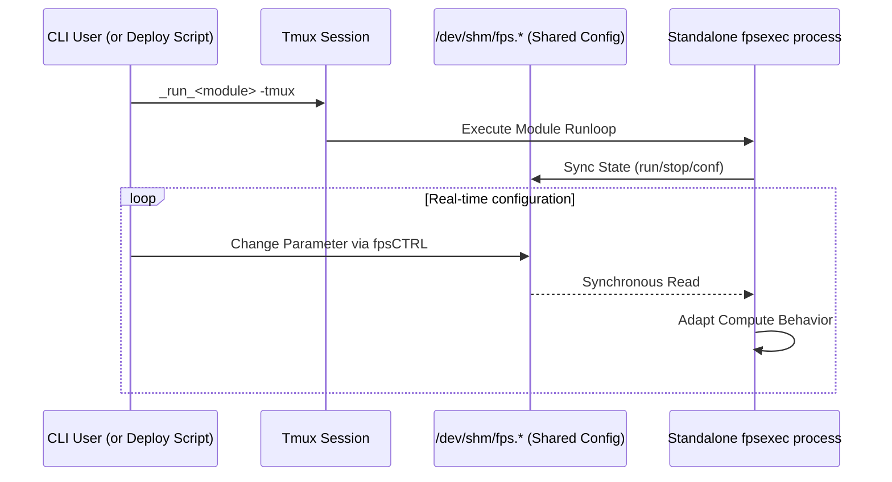

---
tags:
  - fps
  - configuration
  - parameters
  - shared-memory
---

# Function Processing System (FPS)

The Function Processing System (FPS) is `milk`'s core
framework for managing configuration parameters, states,
and commands for compute units. FPS instances provide a
high-performance standardized interface directly in
shared memory.

See also: [Streams](streams.md) ·
[Process Info](procinfo.md) ·
[Programmer's Guide](programmers_guide.md) ·
[FPS Standalone Modes](FPS_Standalone_CMD_Modes.md) ·
[FPS Sequencer](sequencer.md)

## 1. Architecture and Location

An FPS instance creates a shared memory directory
structure typically residing under
`/dev/shm/fps.<fps_name>.datadir/` and
`/dev/shm/fps.<fps_name>.confdir/`. This allows multiple
independent processes, CLIs, and GUIs to read and modify
a running module's behavior simultaneously without
overhead.

## 2. Key Features

1. **Parameter Management:**
   FPS maps standard C variables (like strings, integers,
   and floats) directly into shared memory. When a user
   updates a parameter via the CLI (e.g., `milk-fpsCTRL`
   or the module's script), the compute loop instantly
   sees the change without needing a restart.

2. **Process State Control:**
   FPS inherently tracks compute unit states such as
   `run`, `stop`, `step`, and `conf`. This allows
   standard utilities to instruct a running process to
   pause, take a single execution step, or gracefully
   shut down.

3. **CLI & TUI Integration:**
   Standard utilities like `milk-fpsCTRL` provide a Text
   User Interface (TUI) to interact with FPS instances in
   real-time. This provides an instant "dashboard" for
   any correctly built compute module.

4. **Tmux Dispatch and Isolation:**
   When an FPS process is launched standalone (usually
   using `milk-fpsexec-<name>`, `cacao-fps-deploy`, or
   with the `-tmux` flag), the command is wrapped and
   dispatched into its own `tmux` session. This provides
   complete fault isolation. If one component
   segmentation faults, it does not bring down the entire
   pipeline, and its terminal output can be easily
   examined for debugging.



## 3. Usage Utilities

To use FPS-enabled functions from the command line efficiently, the typical workflow is:

1. Define functions and their requested FPS names in `fpslist.txt`.
2. Generate command scripts using `fpsmkcmd`.
3. Launch and manage them via `milk-fpsCTRL`.

### The `fpslist.txt` and `fpsmkcmd` workflow

Create a file named `fpslist.txt` to list the functions and their instance names:

| FPS Root Name  | CLI Command   | Optional Arguments |
| -------------- | ------------- | ------------------ |
| `fpsrootname0` | `CLIcommand0` |                    |
| `fpsrootname1` | `CLIcommand1` | `optarg00` ...     |

Then run `milk-fpsmkcmd` to automatically generate startup scripts for initialization and running (`<fpsname>-confinit`, `<fpsname>-runstart`, etc.).

### `milk-fpsCTRL`

The primary TUI control tool is `milk-fpsCTRL`. For example, `milk-fpsCTRL -m _ALL` scans and manages all FPS instances defined in `fpslist.txt`.

## 4. Parameter Data Types and Flags

=== ":material-format-list-bulleted: Data Types"

    FPS natively supports the following parameter types.
    Use these `FPTYPE_*` constants in `FPS_PARAMS`
    X-macro entries:

    | Constant                   | C Variable Type                      | Description                 |
    | -------------------------- | ------------------------------------ | --------------------------- |
    | `FPTYPE_INT32`             | `int32_t`                            | 32-bit signed integer       |
    | `FPTYPE_UINT32`            | `uint32_t`                           | 32-bit unsigned integer     |
    | `FPTYPE_INT64`             | `int64_t`                            | 64-bit signed integer       |
    | `FPTYPE_UINT64`            | `uint64_t`                           | 64-bit unsigned integer     |
    | `FPTYPE_FLOAT32`           | `float`                              | 32-bit float                |
    | `FPTYPE_FLOAT64`           | `double`                             | 64-bit double               |
    | `FPTYPE_ONOFF`             | `int32_t`                            | Boolean (0=OFF, nonzero=ON) |
    | `FPTYPE_STRING`            | `char[FUNCTION_PARAMETER_STRMAXLEN]` | Generic text string         |
    | `FPTYPE_STREAMNAME`        | `char[FUNCTION_PARAMETER_STRMAXLEN]` | SHM stream name             |
    | `FPTYPE_FILENAME`          | `char[FUNCTION_PARAMETER_STRMAXLEN]` | File path                   |
    | `FPTYPE_FITSFILENAME`      | `char[FUNCTION_PARAMETER_STRMAXLEN]` | FITS file path              |
    | `FPTYPE_EXECFILENAME`      | `char[FUNCTION_PARAMETER_STRMAXLEN]` | Executable path             |
    | `FPTYPE_DIRNAME`           | `char[FUNCTION_PARAMETER_STRMAXLEN]` | Directory path              |
    | `FPTYPE_FPSNAME`           | `char[FUNCTION_PARAMETER_STRMAXLEN]` | Another FPS name            |
    | `FPTYPE_PID`               | `pid_t`                              | Process ID                  |
    | `FPTYPE_TIMESPEC`          | `struct timespec`                    | Timestamp                   |
    | `FPTYPE_PROCESS`           | `char[FUNCTION_PARAMETER_STRMAXLEN]` | Process name                |
    | `FPTYPE_STRING_NOT_STREAM` | `char[FUNCTION_PARAMETER_STRMAXLEN]` | String (not a stream)       |

    For string-type parameters, pass the buffer name
    directly (it decays to `char*`). For scalar types,
    pass `&variable`.

=== ":material-flag: Flags"

    Flags control parameter behavior and TUI visibility.
    Combine with bitwise OR (`|`):

    **Input/Output presets:**

    | Flag                            | Effect                                                                  |
    | ------------------------------- | ----------------------------------------------------------------------- |
    | `FPFLAG_DEFAULT_INPUT`          | Standard input (active, visible, writable, save-on-change, CLI primary) |
    | `FPFLAG_DEFAULT_OUTPUT`         | Standard output (active, visible, read-only)                            |
    | `FPFLAG_DEFAULT_INPUT_STREAM`   | Input stream (adds run-required + stream-check)                         |
    | `FPFLAG_DEFAULT_TRIGGER_STREAM` | Input stream that triggers computation                                  |
    | `FPFLAG_DEFAULT_OUTPUT_STREAM`  | Output stream                                                           |

    **Modifiers (combine with presets):**

    | Flag                             | Effect                           |
    | -------------------------------- | -------------------------------- |
    | `FPFLAG_MINLIMIT`                | Enforce minimum value            |
    | `FPFLAG_MAXLIMIT`                | Enforce maximum value            |
    | `FPFLAG_WRITERUN`                | Allow modification while running |
    | `FPFLAG_WRITECONF`               | Allow modification during config |
    | `FPFLAG_STREAM_ENFORCE_DATATYPE` | Validate stream datatype         |

=== ":material-code-tags: Developer Integration"

    Integrating with FPS uses the V2 X-macro pattern.
    Parameters are defined **once** and automatically
    generate FPS entries, CLI arguments, and help text.

    **X-macro field order:**
    `X(keyword, ptr, type, is_primary, flag, descr)`

    ```c
    // Local variables (section 2)
    static char in_name[FUNCTION_PARAMETER_STRMAXLEN];
    static double gain = 0.5;
    static int64_t nbiter = 100;

    // X-macro (section 3)
    #define FPS_PARAMS(X)                           \
        X(".in_name", in_name,                      \
          FPTYPE_STREAMNAME, 1,                     \
          FPFLAG_DEFAULT_TRIGGER_STREAM,            \
          "Input stream")                           \
        X(".gain", &gain,                           \
          FPTYPE_FLOAT64, 1,                        \
          FPFLAG_DEFAULT_INPUT                      \
          | FPFLAG_MINLIMIT | FPFLAG_MAXLIMIT       \
          | FPFLAG_WRITERUN,                        \
          "Loop gain")                              \
        X(".NBiter", &nbiter,                       \
          FPTYPE_INT64, 0,                          \
          FPFLAG_DEFAULT_INPUT,                     \
          "Number of iterations")
    ```

    See the [Developer Tutorial](developer/tutorial.md)
    and `src/milk_module_example/examplefunc_fps_cli_poc.c`
    for a complete walkthrough.

### 5. Sequencer Integration

FPS instances can be highly coordinated via the `milk-seq` standalone sequencer, which provides cross-process synchronization (`wait_fps`), robust error handling, loops, and condition-based execution.

See the dedicated **[FPS Sequencer Documentation](sequencer.md)** for details on the `milk-seq` daemon, script syntax, and integrating `seq.*` commands from within `milk-cli`.

---

← [Documentation Index](index.md)
