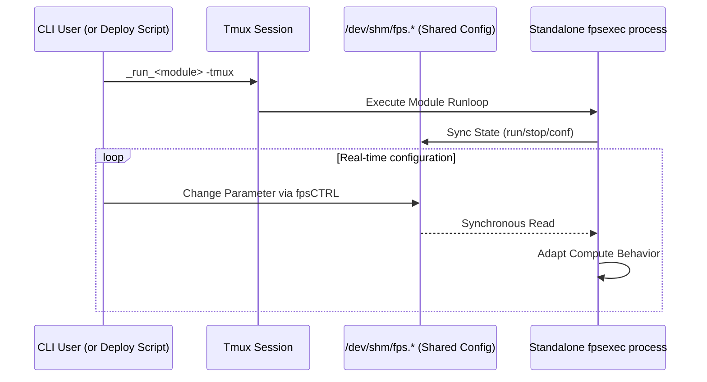

# Function Processing System (FPS)

The Function Processing System (FPS) is `milk`'s core
framework for managing configuration parameters, states,
and commands for compute units. FPS instances provide a
high-performance standardized interface directly in
shared memory.

See also: [Streams](streams.md) ·
[Process Info](procinfo.md) ·
[Programmer's Guide](programmers_guide.md) ·
[FPS Standalone Modes](FPS_Standalone_CMD_Modes.md)

## 1. Architecture and Location

An FPS instance creates a shared memory directory
structure typically residing under
`/dev/shm/fps.<fps_name>.datadir/` and
`/dev/shm/fps.<fps_name>.confdir/`. This allows multiple
independent processes, CLIs, and GUIs to read and modify
a running module's behavior simultaneously without
overhead.

## 2. Key Features

1. **Parameter Management:**
   FPS maps standard C variables (like strings, integers,
   and floats) directly into shared memory. When a user
   updates a parameter via the CLI (e.g., `milk-fpsCTRL`
   or the module's script), the compute loop instantly
   sees the change without needing a restart.
   
2. **Process State Control:**
   FPS inherently tracks compute unit states such as
   `run`, `stop`, `step`, and `conf`. This allows
   standard utilities to instruct a running process to
   pause, take a single execution step, or gracefully
   shut down.

3. **CLI & TUI Integration:**
   Standard utilities like `milk-fpsCTRL` provide a Text
   User Interface (TUI) to interact with FPS instances in
   real-time. This provides an instant "dashboard" for
   any correctly built compute module.

4. **Tmux Dispatch and Isolation:**
   When an FPS process is launched standalone (usually
   using `milk-fpsexec-<name>`, `cacao-fps-deploy`, or
   with the `-tmux` flag), the command is wrapped and
   dispatched into its own `tmux` session. This provides
   complete fault isolation. If one component
   segmentation faults, it does not bring down the entire
   pipeline, and its terminal output can be easily
   examined for debugging.

## 3. Usage Utilities

To use FPS-enabled functions from the command line efficiently, the typical workflow is:
1. Define functions and their requested FPS names in `fpslist.txt`.
2. Generate command scripts using `fpsmkcmd`.
3. Launch and manage them via `milk-fpsCTRL`.

### The `fpslist.txt` and `fpsmkcmd` workflow
Create a file named `fpslist.txt` to list the functions and their instance names:

| FPS Root Name | CLI Command | Optional Arguments |
|---------------|-------------|--------------------|
| `fpsrootname0`| `CLIcommand0`|                    |
| `fpsrootname1`| `CLIcommand1`| `optarg00` ...     |

Then run `milk-fpsmkcmd` to automatically generate startup scripts for initialization and running (`<fpsname>-confinit`, `<fpsname>-runstart`, etc.).

### `milk-fpsCTRL`
The primary TUI control tool is `milk-fpsCTRL`. For example, `milk-fpsCTRL -m _ALL` scans and manages all FPS instances defined in `fpslist.txt`.

## 4. Parameter Data Types
FPS natively supports multiple parameter forms and configurations:
- `ONOFF`: Booleans (0/1)
- `INT`: Integer values
- `FLOAT`: Floating-point measurements
- `STRING`: Texts and paths
- `TIMESPEC`: Specific timestamp mapping structures
- `STREAMNAME`: Name of a shared memory stream
- `FILENAME`: File path on disk

### 4.1. Common Parameter Flags
When creating parameters, you can apply flags to configure their behavior and GUI visibility:
- `FPFLAG_DEFAULT_INPUT`: Standard interactive input
  parameter (combines `FPFLAG_ACTIVE`,
  `FPFLAG_USED`, `FPFLAG_VISIBLE`, `FPFLAG_WRITE`,
  `FPFLAG_WRITECONF`, `FPFLAG_SAVEONCHANGE`,
  `FPFLAG_FEEDBACK`, `FPFLAG_WRITESTATUS`).
- `FPFLAG_CLI_INPUT`: Typically combined with default
  input.
- `FPFLAG_MINLIMIT` / `FPFLAG_MAXLIMIT`: Enforces
  min/max boundaries on the parameter.

For a module developer, integrating with FPS generally
entails filling out `FPS_APP_INFO` to register an
identity, defining `FPS_PARAMS` with an X-macro to bind
shared memory to local C references, and wrapping the
core math inside `fpsexec()`.

---
← [Documentation Index](index.md)
