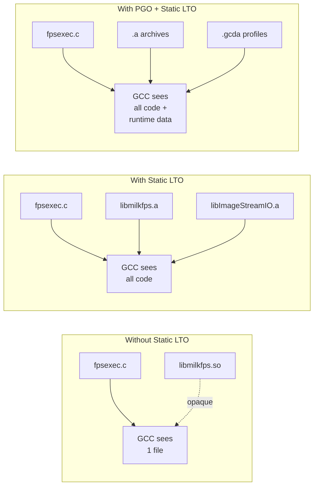

# Profile-Guided Optimization (PGO) & Link-Time Optimization (LTO)

The `milk` build system supports two complementary
compiler optimization techniques for `fpsexec`
standalone executables:

| Technique     | CMake Flag               | Typical Speedup |
| ------------- | ------------------------ | --------------- |
| **PGO**       | `-DUSE_PGO=GENERATE/USE` | 10–30%          |
| **LTO**       | `-DUSE_STATIC_LTO=ON`    | 5–15%           |
| **PGO + LTO** | Both                     | **15–40%**      |

!!! tip
For maximum performance on production AO systems,
enable **both** PGO and static LTO. The techniques
are complementary — LTO exposes cross-library code
to GCC, and PGO then trains the optimizer with
real branch/call data across that larger scope.

---

## 1. Link-Time Optimization (LTO)

### 1.1. What LTO Does

LTO (`-flto=auto`) allows GCC to optimize across
translation-unit boundaries. Instead of compiling
each `.c` file in isolation, GCC serializes its
intermediate representation (GIMPLE IR) into object
files and performs whole-program optimization at
link time.

Without static LTO, standalone executables link
shared libraries (`.so`), which are opaque — the
linker cannot see inside them:

```text
fpsexec.c  →  fpsexec.o  →  fpsexec
                             ↓ (dynamic)
              libmilkfps.so  ← opaque to LTO
              libImageStreamIO.so  ← opaque
```

With static LTO (`USE_STATIC_LTO=ON`), the same
libraries are linked as static archives (`.a`).
GCC can now inline across all library boundaries:

```text
fpsexec.c  →  fpsexec.o  ──┐
libmilkfps.a  ──────────────┼→  LTO link  →  fpsexec
libImageStreamIO.a  ────────┤   (full visibility)
libCOREMODmemory_compute.a ─┘
```

### 1.2. Why Static Linking Is Faster

Statically linked executables eliminate several
layers of runtime overhead present in dynamically
linked binaries:

**PLT/GOT elimination.** Every call to a shared
library function goes through the Procedure Linkage
Table (PLT) and Global Offset Table (GOT) — an
indirect jump that the CPU branch predictor cannot
fully resolve. In a tight real-time loop calling
`ImageStreamIO_sempost()` or `fps_to_local()` at
tens of kHz, these indirect jumps add measurable
latency. Static linking replaces them with direct
calls or inlined code.

**No dynamic loader overhead.** At startup, `ld.so`
must resolve all symbol relocations, map `.so`
pages, and apply RELRO protections. Standalone
executables with 14 shared libraries pay this cost
on every launch. A statically linked binary is
ready to execute immediately — important for rapid
fault recovery in production AO loops.

**Improved branch prediction.** Direct calls from
static linking have fixed target addresses known at
link time. The CPU's branch target buffer (BTB) can
predict these perfectly after the first execution,
whereas PLT stubs pollute the BTB with indirect
entries.

### 1.3. How LTO Keeps Static Binaries Small

A naïve static link pulls in **every** object file
from each `.a` archive — even functions the
executable never calls. This would bloat binaries
unacceptably. LTO solves this:

**Dead-code elimination.** With `-flto=auto`, GCC
sees the entire program (executable + all static
archives) as a single optimization unit. It traces
all reachable call paths from `main()` and
**discards every function, variable, and data
structure that is not reachable**. Entire
translation units that are unused vanish from the
final binary.

**Cross-module inlining + elimination.** LTO first
inlines small hot functions across library
boundaries (e.g., `ImageStreamIO_sempost()` into
your compute loop). After inlining, the original
library function may have zero remaining callers —
LTO then eliminates it entirely. The net effect:
the binary contains **only the machine code that
actually executes**, inlined at the call sites where
it's needed.

**Measured example:**

| Binary         | Dynamic                   | Static+LTO              | Ratio               |
| -------------- | ------------------------- | ----------------------- | ------------------- |
| `arith-crop2D` | 52 KB (.so deps: ~2.4 MB) | 173 KB (self-contained) | 3.3× larger on disk |

The static binary is 3.3× larger than the dynamic
stub, but **far smaller than the total code footprint
of 14 shared libraries** (2.4 MB mapped in
aggregate). LTO stripped the vast majority of
library code that `crop2D` never calls.

### 1.4. Why Small Binaries Run Faster

Modern CPUs execute code from the **instruction
cache** (L1i), typically 32–64 KB. When the
executable's hot path fits in icache, the CPU never
stalls waiting for instruction fetches from L2/L3:

```text
┌──────────────────────────────────────┐
│ L1 Instruction Cache (32-64 KB)      │
│                                      │
│  Dynamic link:                       │
│  fpsexec code + PLT stubs            │
│  + scattered .so code pages          │
│  → icache thrashing, frequent misses │
│                                      │
│  Static LTO:                         │
│  fpsexec code + inlined hot paths    │
│  → compact, sequential, cache-warm   │
└──────────────────────────────────────┘
```

**Dynamic linking scatters hot code.** The compute
function lives in the executable, but
`sem_post()` is in `libpthread.so`,
`ImageStreamIO_sempost()` is in
`libImageStreamIO.so`, and `fps_to_local()` is in
`libmilkfps.so`. Each call jumps to a different
memory region, evicting other hot code from icache.

**Static LTO consolidates hot code.** After
inlining, the compute function, semaphore
operations, and FPS parameter access are all
compiled into a single contiguous code region. The
CPU's instruction prefetcher can stream this code
sequentially, and the entire hot loop fits in L1i.

!!! important
For real-time AO loops running at 1–10 kHz,
icache pressure is the dominant performance
bottleneck after algorithmic optimization.
Reducing the hot-path footprint from scattered
`.so` pages to a compact inlined binary is one
of the most impactful optimizations available.

### 1.5. Summary: Static LTO Benefits

| Benefit                | Mechanism                               | Impact                               |
| ---------------------- | --------------------------------------- | ------------------------------------ |
| No PLT indirection     | Direct calls replace GOT lookups        | Lower per-call latency               |
| Cross-library inlining | GCC inlines across `.a` boundaries      | Eliminates call overhead entirely    |
| Dead-code elimination  | Unreachable code removed at link        | Smaller binary, less icache pressure |
| Constant propagation   | GCC propagates constants across modules | Simpler generated code               |
| Compact hot path       | Inlined code is sequential in memory    | L1i cache stays warm                 |
| Zero startup overhead  | No `ld.so` symbol resolution            | Faster process launch                |

### 1.6. Build Modes

Two approaches are available, depending on whether
you need full static linking or just LTO on the
executable itself:

#### Option A — Static LTO (recommended)

Builds static archive variants (`.a`) of every
milk library and links them into standalone
executables. Gives GCC maximum cross-module
visibility.

```bash
cd /home/oguyon/src/milk-perf/_build

cmake .. \
  -DCMAKE_BUILD_TYPE=Release \
  -DUSE_STATIC_LTO=ON \
  -DCMAKE_C_FLAGS="-O3 -march=native"

make -j$(nproc)
sudo make install
```

`milk-perfbench` build tag: **`O3 LTO-static [x86_64]`**

#### Option B — Dynamic LTO (manual flags)

Keeps the default dynamic `.so` linking but
passes `-flto` explicitly. LTO operates only
within the executable's own compilation units —
cross-library inlining is **not** available, but
the executable's hot path is still LTO-optimized.

```bash
cmake .. \
  -DCMAKE_BUILD_TYPE=Release \
  -DUSE_STATIC_LTO=OFF \
  -DCMAKE_C_FLAGS="-O3 -march=native -flto=auto" \
  -DCMAKE_EXE_LINKER_FLAGS="-flto=auto -Wl,-O2" \
  -DCMAKE_SHARED_LINKER_FLAGS="-flto=auto"

make -j$(nproc)
sudo make install
```

`milk-perfbench` build tag: **`O3 LTO [x86_64]`**

!!! important
Always pass `-DUSE_STATIC_LTO=OFF` explicitly
when switching to Option B. CMake caches values
between runs — if `USE_STATIC_LTO=ON` was set
previously, it remains active until explicitly
cleared. Forgetting this causes a link error:
`cannot find -lImageStreamIO_static`.

#### Restore Normal Build

After any optimization build, clear flags so
subsequent builds are unaffected:

```bash
cmake .. \
  -DCMAKE_BUILD_TYPE=Release \
  -DUSE_STATIC_LTO=OFF \
  -DCMAKE_C_FLAGS="" \
  -DCMAKE_EXE_LINKER_FLAGS="" \
  -DCMAKE_SHARED_LINKER_FLAGS=""
```

### 1.7. Verifying Static Linking

Check that a standalone has minimal dynamic
dependencies:

```bash
$ ldd /usr/local/bin/milk-fpsexec-arith-crop2D
## Default:  14 shared libs (milkfps.so, ImageStreamIO.so, ...)
## Static LTO:  3 deps (libc, ld-linux, vdso)
```

### 1.8. Verifying the Build Mode

Every fpsexec binary embeds a build-tag sentinel
string that can be inspected with `strings(1)`:

```bash
$ strings milk-fpsexec-imggen-mkrandom | grep 'MILK_BUILD:'
MILK_BUILD:VER=1,...,ARCH=x86_64,OPT=3,LTO=STATIC,END
```

`milk-perfbench` reads and displays this
automatically in its header line:

```text
  Build     : O3 LTO-static [x86_64]
```

Possible `Build:` values:

| Shown                        | Meaning                    |
| ---------------------------- | -------------------------- |
| `default (no PGO/LTO)`       | Plain Release build        |
| `O3 [x86_64]`                | `-O3`, no LTO              |
| `O3 LTO [x86_64]`            | Option B (dynamic LTO)     |
| `O3 LTO-static [x86_64]`     | Option A (static LTO)      |
| `O3 PGO [x86_64]`            | PGO pass-2, no LTO         |
| `O3 PGO LTO [x86_64]`        | PGO + dynamic LTO          |
| `O3 PGO LTO-static [x86_64]` | PGO + static LTO (maximum) |

---

## 2. Profile-Guided Optimization (PGO)

PGO trains GCC with real runtime profiles to
optimize branch prediction, function layout, and
inlining. Typical speedups: **10–30%** on
branch-heavy real-time loops.

### 2.1. Quick Start

```bash
$ cd _build

## Step 1 — Instrument
$ cmake .. -DUSE_PGO=GENERATE
$ make -j$(nproc) && sudo make install

## Step 2 — Run representative workloads
$ milk-fpsexec-streamcopy -n scopy01
$ # ... exercise your typical AO loop patterns

## Step 3 — Rebuild with profiles
$ cmake .. -DUSE_PGO=USE
$ make -j$(nproc) && sudo make install
```

### 2.2. How It Works

| Step | CMake Flag           | GCC Flags                            | Effect                                |
| ---- | -------------------- | ------------------------------------ | ------------------------------------- |
| 1    | `-DUSE_PGO=GENERATE` | `-fprofile-generate`                 | Emits `.gcda` profile data at runtime |
| 2    | _(run workload)_     | —                                    | Collects branch/call counts           |
| 3    | `-DUSE_PGO=USE`      | `-fprofile-use -fprofile-correction` | Optimizes using collected data        |

### 2.3. Per-Executable Profile Isolation

Each standalone binary gets its own profile
subdirectory under `_build/pgo/`:

```text
_build/pgo/
├── shared/                          ← shared libs
├── milk-fpsexec-streamcopy/         ← streamcopy
├── milk-fpsexec-linalg-SGEMM/       ← SGEMM
├── cacao-fpsexec-cacaoloop-WFS/     ← WFS
└── ...
```

This isolation is automatic — the
`milk_pgo_target()` CMake helper (called by
`add_milk_standalone()` / `add_cacao_standalone()`)
sets per-target `-fprofile-dir`.

### 2.4. Optimizing Specific Executables

```bash
$ cd _build

## Step 1 — Build everything with instrumentation
$ cmake .. -DUSE_PGO=GENERATE
$ make -j$(nproc) && sudo make install

## Step 2 — Run ONLY the executables you want to
##          optimize, with realistic workloads
$ milk-fpsexec-streamcopy -n scopy01
$ # let it process several thousand frames, then ^C
$ cacao-fpsexec-cacaoloop-WFS -n wfs01
$ # exercise another workload

## Step 3 — Rebuild with profiles
$ cmake .. -DUSE_PGO=USE
$ make -j$(nproc) && sudo make install
```

Only the executables exercised in Step 2 receive
PGO optimization. Others compile normally — GCC
silently ignores missing profiles when
`-fprofile-correction` is set.

| Component        | Profile directory | Scope                      |
| ---------------- | ----------------- | -------------------------- |
| Standalone `.c`  | `pgo/<exe-name>/` | Independent per executable |
| Shared libraries | `pgo/shared/`     | Aggregated across all runs |

!!! tip
For the best results, run each fpsexec with a
workload that closely matches production use:
same stream sizes, same number of modes, same
loop rate. The more representative the
training run, the better the optimization.

---

## 3. Combined PGO + Static LTO

For maximum performance, combine both techniques.
Static LTO makes library code visible to PGO's
profile-guided optimizer, amplifying both effects:

```bash
$ mkdir _build_opt && cd _build_opt

## Step 1 — Instrument with static LTO
$ cmake .. -DUSE_PGO=GENERATE -DUSE_STATIC_LTO=ON
$ make -j$(nproc) && sudo make install

## Step 2 — Run representative workloads
$ cacao-fpsexec-dmcomb -n dmcomb01
$ # exercise your production AO loop

## Step 3 — Rebuild with profiles + LTO
$ cmake .. -DUSE_PGO=USE -DUSE_STATIC_LTO=ON
$ make -j$(nproc) && sudo make install
```

### Why They Complement Each Other



| Optimization | Scope                      | What it does                                       |
| ------------ | -------------------------- | -------------------------------------------------- |
| LTO alone    | Cross-module               | Inlines library calls, removes dead code           |
| PGO alone    | Per-module                 | Optimizes branch layout from runtime data          |
| PGO + LTO    | **Cross-module + runtime** | Inlines AND profile-optimizes across all libraries |

PGO needs to **see** the function bodies to
optimize them. Static LTO makes library function
bodies visible. Together, PGO can profile-optimize
code paths that span `fpsexec.c` →
`ImageStreamIO` → `milkfps` — the entire hot path
of a real-time loop becomes a single optimization
unit.

---

## 4. Dual Library Architecture

The `milk` build system compiles two variants of
every library to support both the interactive CLI
and standalone fpsexec executables:

### 4.1. Shared Libraries (`.so`) — for CLI

```text
libmilkfps.so
libCOREMODmemory.so
libCOREMODarith.so
...
```

- Linked by `milk-cli` and module shared libraries
- Contain full CLI registration code
  (`RegisterModule`, `RegisterCLIcommand`, etc.)
- Loaded at runtime via `dlopen()` for module
  hot-loading

### 4.2. Compute Libraries (`_compute.so`) — for

Standalones

```text
libCOREMODmemory_compute.so
libCOREMODarith_compute.so
...
```

- Compiled with `-DMILK_NO_CLI` — pure computation
- **No dependency on CLIcore** — CLI registration
  stubs are excluded
- Linked by `milk-fpsexec-*` / `cacao-fpsexec-*`

### 4.3. Static Archives (`.a`) — for Static LTO

When `USE_STATIC_LTO=ON`, a third variant is
built for each library:

```text
libImageStreamIO.a
libmilkfps.a
libmilkfpsStandalone.a
libmilkdata.a
libmilkprocessinfo.a
libCOREMODmemory_compute.a
libCOREMODarith_compute.a
libCOREMODtools_compute.a
libCOREMODiofits_compute.a
```

- Static archives contain the same `.o` files as
  `_compute.so`, but archived for static linking
- GCC can look inside `.a` files at link time,
  enabling cross-module LTO optimization
- Only linked into standalone executables — shared
  libraries and CLI are unaffected

### 4.4. Architecture Diagram

```text
┌─────────────────────────────────────┐
│           milk-cli                  │
│  (interactive shell, module loader) │
│  Links: .so libraries (dynamic)    │
└─────────────┬───────────────────────┘
              │
    ┌─────────┴─────────┐
    │  Module .so libs   │
    │  (CLIcore-linked)  │
    └────────────────────┘

┌─────────────────────────────────────┐
│  milk-fpsexec-* / cacao-fpsexec-*  │
│  (standalone compute units)         │
│                                     │
│  Default: links _compute.so (dyn)  │
│  Static LTO: links .a (static)     │
│  + PGO: adds profiling/use flags   │
└─────────────┬───────────────────────┘
              │
    ┌─────────┴──────────────────────┐
    │  _compute variants             │
    │  (MILK_NO_CLI, no CLIcore)     │
    │                                │
    │  .so → default dynamic link    │
    │  .a  → static LTO link         │
    └────────────────────────────────┘
```

---

## 5. CMake Build Options Summary

| Option           | Default       | Effect                                            |
| ---------------- | ------------- | ------------------------------------------------- |
| `USE_PGO`        | _(off)_       | `GENERATE` or `USE` — profile-guided optimization |
| `USE_STATIC_LTO` | `OFF`         | Static archives + LTO for standalones             |
| `PGO_DIR`        | `_build/pgo/` | Profile data directory                            |

Build configurations:

```bash
## Default (shared libs, no LTO)
cmake .. -DUSE_STATIC_LTO=OFF

## Option A — Static LTO only
cmake .. \
  -DUSE_STATIC_LTO=ON \
  -DCMAKE_C_FLAGS="-O3 -march=native"

## Option B — Dynamic LTO (manual flags)
cmake .. \
  -DUSE_STATIC_LTO=OFF \
  -DCMAKE_C_FLAGS="-O3 -march=native -flto=auto" \
  -DCMAKE_EXE_LINKER_FLAGS="-flto=auto -Wl,-O2" \
  -DCMAKE_SHARED_LINKER_FLAGS="-flto=auto"

## PGO only
cmake .. -DUSE_PGO=GENERATE   # step 1
cmake .. -DUSE_PGO=USE        # step 3

## Maximum optimization (PGO + static LTO)
cmake .. -DUSE_STATIC_LTO=ON -DUSE_PGO=USE

## Restore normal build (clear all flags)
cmake .. \
  -DUSE_STATIC_LTO=OFF \
  -DCMAKE_C_FLAGS="" \
  -DCMAKE_EXE_LINKER_FLAGS="" \
  -DCMAKE_SHARED_LINKER_FLAGS=""
```

!!! danger
CMake **caches** all `-D` options between runs.
Always pass `-DUSE_STATIC_LTO=OFF` explicitly
when switching away from static LTO. Omitting it
leaves `USE_STATIC_LTO=ON` in the cache and
causes `cannot find -lImageStreamIO_static`.

### CMake Policy

Add `cmake_policy(SET CMP0069 NEW)` to any
`CMakeLists.txt` that calls `add_library()` to
suppress the `INTERPROCEDURAL_OPTIMIZATION`
policy warning when `-DCMAKE_INTERPROCEDURAL_OPTIMIZATION=ON`
is set. This is already applied to `CLIcore`.

---

## 6. Manual CMake Flags (Dynamic Libs)

This is **Option B** from section 1.6 — applying
PGO on top of dynamic-lib LTO when
`USE_STATIC_LTO` is not used.

---

## 7. Notes

- Profile data (`.gcda` files) is written to
  `PGO_DIR` (default: `_build/pgo/`).
  Override with `-DPGO_DIR=/path/to/profiles`.
- `-fprofile-correction` handles minor mismatches
  from multi-threaded execution and missing
  profiles.
- Re-run the full PGO cycle whenever you make
  significant code changes.
- To disable PGO, omit the `-DUSE_PGO` flag
  (or set it to empty).
- Static LTO increases binary sizes (2–3×) since
  library code is embedded — this is expected.
- Build time with static LTO is longer due to
  whole-program optimization at link time.
- **CMake cache:** always pass `-DUSE_STATIC_LTO=OFF`
  when switching back to dynamic builds. Cached
  `ON` causes `cannot find -lXxx_static` errors.
- **Build tag:** every fpsexec embeds a
  `MILK_BUILD:` sentinel string in `.rodata`
  readable via `strings | grep MILK_BUILD:`. The
  `milk-perfbench` header reports this as the
  `Build:` line, allowing unambiguous verification
  that the right optimization level was applied.

---

## 8. Fully Static Binaries with musl libc

For maximum portability — deploying a single
self-contained binary to a target machine without
installing any runtime libraries — you can build
`fpsexec` executables against
[musl libc](https://musl.libc.org/) instead of glibc.

!!! note
The standard static LTO build (section 1.6 Option A)
still depends on the system glibc at runtime (3 libs:
`libc.so`, `ld-linux.so`, `libm.so`). The musl build
here produces a true **zero-dependency** binary.

### 8.1. Prerequisites

```bash
## Ubuntu / Debian
sudo apt install musl-tools musl-dev
```

Verify the toolchain is present:

```bash
$ musl-gcc --version
musl-gcc (GCC 11.4.0)
```

### 8.2. Build a Static musl Binary

```bash
cd /path/to/milk-perf
mkdir -p _build_musl && cd _build_musl

cmake .. \
  -DCMAKE_C_COMPILER=musl-gcc \
  -DCMAKE_BUILD_TYPE=Release \
  -DCMAKE_C_FLAGS="-O3 -march=native -D_GNU_SOURCE \
    -I/path/to/milk-perf/src/coremods \
    -I/path/to/milk-perf/src" \
  -DCMAKE_EXE_LINKER_FLAGS="-static" \
  -DUSE_STATIC_LTO=ON \
  -DUSE_CFITSIO=OFF \
  -DUSE_CLI=OFF \
  -DUSE_NCURSES=OFF \
  -DUSE_READLINE=OFF \
  -DUSE_OPENBLAS=OFF \
  -DBUILD_SHARED_LIBS=OFF

## Build a specific standalone executable
make milk-fpsexec-imggen-mkrandom -j$(nproc)
```

Replace `/path/to/milk-perf` with the absolute path
to your source tree. The `-D_GNU_SOURCE` flag is
required to expose `cpu_set_t` and thread affinity
APIs; the extra include paths expose `COREMOD_memory`
headers needed by plugins built with `-DUSE_CLI=OFF`.

### 8.3. Verify the Binary is Fully Static

```bash
$ ldd _build_musl/plugins/.../milk-fpsexec-imggen-mkrandom
    not a dynamic executable

$ file milk-fpsexec-imggen-mkrandom
ELF 64-bit LSB executable, x86-64,
statically linked, with debug_info, not stripped

$ ls -lh milk-fpsexec-imggen-mkrandom
291K
```

No shared library dependencies — deploy by copying
the single binary file.

### 8.4. Install

**Copy to system `bin`:**

```bash
sudo cp _build_musl/plugins/milk-extra-src/image_gen/milk-fpsexec-imggen-mkrandom \
    /usr/local/bin/
```

**Copy to user `bin` (no sudo):**

```bash
cp milk-fpsexec-imggen-mkrandom ~/bin/
```

**Deploy to a remote machine:**

```bash
scp milk-fpsexec-imggen-mkrandom user@target-host:/usr/local/bin/
```

Because the binary is fully self-contained, no
library installation is needed on the target.

### 8.5. Required CMake Flags and Why

| Flag                     | Value      | Reason                                                                           |
| ------------------------ | ---------- | -------------------------------------------------------------------------------- |
| `CMAKE_C_COMPILER`       | `musl-gcc` | Wrapper that redirects includes/libs to musl                                     |
| `CMAKE_EXE_LINKER_FLAGS` | `-static`  | Tells the linker to produce a static binary                                      |
| `USE_STATIC_LTO`         | `ON`       | Builds `.a` archives; required by `-static`                                      |
| `USE_CFITSIO`            | `OFF`      | System cfitsio is glibc-linked; incompatible with musl static                    |
| `USE_CLI`                | `OFF`      | CLI requires readline dynamic libs                                               |
| `USE_READLINE`           | `OFF`      | readline has no musl static variant by default                                   |
| `USE_OPENBLAS`           | `OFF`      | System OpenBLAS is glibc-linked                                                  |
| `BUILD_SHARED_LIBS`      | `OFF`      | Prevents cmake from building `.so` targets that would fail the static link       |
| `-D_GNU_SOURCE` (C flag) | set        | Exposes `cpu_set_t`, `pthread_setaffinity_np` and other POSIX extensions in musl |

### 8.6. Known Warnings (Non-Fatal)

**`_GNU_SOURCE` redefined:**

```text
fps_standalone_data.c:6:9: warning: '_GNU_SOURCE' redefined
```

`fps_standalone_data.c` defines `_GNU_SOURCE`
internally; passing it as a CMake flag causes a
harmless redefinition. No action required.

**LTO type mismatch on `copy_image_ID`:**

```text
warning: type of 'copy_image_ID' does not match original declaration [-Wlto-type-mismatch]
image_copy.h: return value: imageID vs int
```

`fps_loadmemstream_lite.c` declares `copy_image_ID`
as `int` while `image_copy.h` uses `typedef imageID`.
This is a pre-existing mismatch in the codebase (not
introduced by the musl build). The binary is correct
because `imageID` is `typedef long` which matches
GCC's `int` ABI on the return path. No runtime
impact.

### 8.7. Limitations Compared to Standard Static LTO

| Feature                | Standard static LTO | musl static       |
| ---------------------- | ------------------- | ----------------- |
| CFITSIO support        | ✓                   | ✗ (glibc-only)    |
| OpenBLAS/MKL           | ✓                   | ✗                 |
| Dynamic library deps   | 3 (libc family)     | **0**             |
| Deploy without runtime | ✗                   | **✓**             |
| Binary portability     | Same glibc version  | Any Linux x86-64  |
| PGO compatible         | ✓                   | ✓ (same workflow) |

### 8.8. musl vs glibc `strerror_r` ABI

musl implements the POSIX (XSI) variant of
`strerror_r` which returns `int`, whereas glibc
defaults to the GNU variant returning `char *`.
The milk source correctly detects this via
`#ifndef __GLIBC__` in `ImageStreamIO.c` — no
user action needed.

---

← [Documentation Index](index.md)
