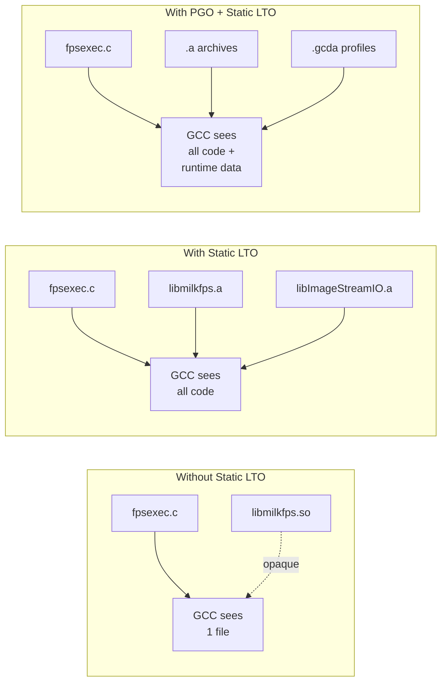

# Profile-Guided Optimization (PGO) & Link-Time
# Optimization (LTO)

The `milk` build system supports two complementary
compiler optimization techniques for `fpsexec`
standalone executables:

| Technique | CMake Flag | Typical Speedup |
|-----------|-----------|-----------------|
| **PGO** | `-DUSE_PGO=GENERATE/USE` | 10–30% |
| **LTO** | `-DUSE_STATIC_LTO=ON` | 5–15% |
| **PGO + LTO** | Both | **15–40%** |

> [!TIP]
> For maximum performance on production AO systems,
> enable **both** PGO and static LTO. The techniques
> are complementary — LTO exposes cross-library code
> to GCC, and PGO then trains the optimizer with
> real branch/call data across that larger scope.

---

## 1. Link-Time Optimization (LTO)

### 1.1. What LTO Does

LTO (`-flto=auto`) allows GCC to optimize across
translation-unit boundaries. Instead of compiling
each `.c` file in isolation, GCC serializes its
intermediate representation (GIMPLE IR) into object
files and performs whole-program optimization at
link time.

Without static LTO, standalone executables link
shared libraries (`.so`), which are opaque — the
linker cannot see inside them:

```
fpsexec.c  →  fpsexec.o  →  fpsexec
                             ↓ (dynamic)
              libmilkfps.so  ← opaque to LTO
              libImageStreamIO.so  ← opaque
```

With static LTO (`USE_STATIC_LTO=ON`), the same
libraries are linked as static archives (`.a`).
GCC can now inline across all library boundaries:

```
fpsexec.c  →  fpsexec.o  ──┐
libmilkfps.a  ──────────────┼→  LTO link  →  fpsexec
libImageStreamIO.a  ────────┤   (full visibility)
libCOREMODmemory_compute.a ─┘
```

### 1.2. Benefits

- **Cross-library inlining**: Hot functions in
  `ImageStreamIO` (semaphore post, stream access)
  can be inlined into your compute function
- **Dead-code elimination**: Unreachable library
  code is stripped from the binary
- **Interprocedural constant propagation**: GCC
  optimizes across function boundaries that were
  previously opaque `.so` barriers
- **Reduced dynamic linking overhead**: No PLT
  (Procedure Linkage Table) indirection for
  library calls

### 1.3. Usage

```bash
$ mkdir _build_lto && cd _build_lto
$ cmake .. -DUSE_STATIC_LTO=ON
$ make -j$(nproc) && sudo make install
```

> [!NOTE]
> Static LTO only affects `fpsexec` standalone
> executables. Shared libraries and the `milk-cli`
> binary are unchanged.

### 1.4. Verifying Static Linking

Check that a standalone has minimal dynamic
dependencies:

```bash
$ ldd /usr/local/bin/milk-fpsexec-arith-crop2D
# Default:  14 shared libs (milkfps.so, ImageStreamIO.so, ...)
# Static LTO:  3 deps (libc, ld-linux, vdso)
```

---

## 2. Profile-Guided Optimization (PGO)

PGO trains GCC with real runtime profiles to
optimize branch prediction, function layout, and
inlining. Typical speedups: **10–30%** on
branch-heavy real-time loops.

### 2.1. Quick Start

```bash
$ cd _build

# Step 1 — Instrument
$ cmake .. -DUSE_PGO=GENERATE
$ make -j$(nproc) && sudo make install

# Step 2 — Run representative workloads
$ milk-fpsexec-streamcopy -n scopy01
$ # ... exercise your typical AO loop patterns

# Step 3 — Rebuild with profiles
$ cmake .. -DUSE_PGO=USE
$ make -j$(nproc) && sudo make install
```

### 2.2. How It Works

| Step | CMake Flag | GCC Flags | Effect |
|------|-----------|-----------|--------|
| 1 | `-DUSE_PGO=GENERATE` | `-fprofile-generate` | Emits `.gcda` profile data at runtime |
| 2 | *(run workload)* | — | Collects branch/call counts |
| 3 | `-DUSE_PGO=USE` | `-fprofile-use -fprofile-correction` | Optimizes using collected data |

### 2.3. Per-Executable Profile Isolation

Each standalone binary gets its own profile
subdirectory under `_build/pgo/`:

```
_build/pgo/
├── shared/                          ← shared libs
├── milk-fpsexec-streamcopy/         ← streamcopy
├── milk-fpsexec-linalg-SGEMM/       ← SGEMM
├── cacao-fpsexec-cacaoloop-WFS/     ← WFS
└── ...
```

This isolation is automatic — the
`milk_pgo_target()` CMake helper (called by
`add_milk_standalone()` / `add_cacao_standalone()`)
sets per-target `-fprofile-dir`.

### 2.4. Optimizing Specific Executables

```bash
$ cd _build

# Step 1 — Build everything with instrumentation
$ cmake .. -DUSE_PGO=GENERATE
$ make -j$(nproc) && sudo make install

# Step 2 — Run ONLY the executables you want to
#          optimize, with realistic workloads
$ milk-fpsexec-streamcopy -n scopy01
$ # let it process several thousand frames, then ^C
$ cacao-fpsexec-cacaoloop-WFS -n wfs01
$ # exercise another workload

# Step 3 — Rebuild with profiles
$ cmake .. -DUSE_PGO=USE
$ make -j$(nproc) && sudo make install
```

Only the executables exercised in Step 2 receive
PGO optimization. Others compile normally — GCC
silently ignores missing profiles when
`-fprofile-correction` is set.

| Component | Profile directory | Scope |
|-----------|------------------|-------|
| Standalone `.c` | `pgo/<exe-name>/` | Independent per executable |
| Shared libraries | `pgo/shared/` | Aggregated across all runs |

> [!TIP]
> For the best results, run each fpsexec with a
> workload that closely matches production use:
> same stream sizes, same number of modes, same
> loop rate. The more representative the
> training run, the better the optimization.

---

## 3. Combined PGO + Static LTO

For maximum performance, combine both techniques.
Static LTO makes library code visible to PGO's
profile-guided optimizer, amplifying both effects:

```bash
$ mkdir _build_opt && cd _build_opt

# Step 1 — Instrument with static LTO
$ cmake .. -DUSE_PGO=GENERATE -DUSE_STATIC_LTO=ON
$ make -j$(nproc) && sudo make install

# Step 2 — Run representative workloads
$ cacao-fpsexec-dmcomb -n dmcomb01
$ # exercise your production AO loop

# Step 3 — Rebuild with profiles + LTO
$ cmake .. -DUSE_PGO=USE -DUSE_STATIC_LTO=ON
$ make -j$(nproc) && sudo make install
```

### Why They Complement Each Other



| Optimization | Scope | What it does |
|-------------|-------|--------------|
| LTO alone | Cross-module | Inlines library calls, removes dead code |
| PGO alone | Per-module | Optimizes branch layout from runtime data |
| PGO + LTO | **Cross-module + runtime** | Inlines AND profile-optimizes across all libraries |

PGO needs to **see** the function bodies to
optimize them. Static LTO makes library function
bodies visible. Together, PGO can profile-optimize
code paths that span `fpsexec.c` →
`ImageStreamIO` → `milkfps` — the entire hot path
of a real-time loop becomes a single optimization
unit.

---

## 4. Dual Library Architecture

The `milk` build system compiles two variants of
every library to support both the interactive CLI
and standalone fpsexec executables:

### 4.1. Shared Libraries (`.so`) — for CLI

```
libmilkfps.so
libCOREMODmemory.so
libCOREMODarith.so
...
```

- Linked by `milk-cli` and module shared libraries
- Contain full CLI registration code
  (`RegisterModule`, `RegisterCLIcommand`, etc.)
- Loaded at runtime via `dlopen()` for module
  hot-loading

### 4.2. Compute Libraries (`_compute.so`) — for
Standalones

```
libCOREMODmemory_compute.so
libCOREMODarith_compute.so
...
```

- Compiled with `-DMILK_NO_CLI` — pure computation
- **No dependency on CLIcore** — CLI registration
  stubs are excluded
- Linked by `milk-fpsexec-*` / `cacao-fpsexec-*`

### 4.3. Static Archives (`.a`) — for Static LTO

When `USE_STATIC_LTO=ON`, a third variant is
built for each library:

```
libImageStreamIO.a
libmilkfps.a
libmilkfpsStandalone.a
libmilkdata.a
libmilkprocessinfo.a
libCOREMODmemory_compute.a
libCOREMODarith_compute.a
libCOREMODtools_compute.a
libCOREMODiofits_compute.a
```

- Static archives contain the same `.o` files as
  `_compute.so`, but archived for static linking
- GCC can look inside `.a` files at link time,
  enabling cross-module LTO optimization
- Only linked into standalone executables — shared
  libraries and CLI are unaffected

### 4.4. Architecture Diagram

```
┌─────────────────────────────────────┐
│           milk-cli                  │
│  (interactive shell, module loader) │
│  Links: .so libraries (dynamic)    │
└─────────────┬───────────────────────┘
              │
    ┌─────────┴─────────┐
    │  Module .so libs   │
    │  (CLIcore-linked)  │
    └────────────────────┘

┌─────────────────────────────────────┐
│  milk-fpsexec-* / cacao-fpsexec-*  │
│  (standalone compute units)         │
│                                     │
│  Default: links _compute.so (dyn)  │
│  Static LTO: links .a (static)     │
│  + PGO: adds profiling/use flags   │
└─────────────┬───────────────────────┘
              │
    ┌─────────┴──────────────────────┐
    │  _compute variants             │
    │  (MILK_NO_CLI, no CLIcore)     │
    │                                │
    │  .so → default dynamic link    │
    │  .a  → static LTO link         │
    └────────────────────────────────┘
```

---

## 5. CMake Build Options Summary

| Option | Default | Effect |
|--------|---------|--------|
| `USE_PGO` | *(off)* | `GENERATE` or `USE` — profile-guided optimization |
| `USE_STATIC_LTO` | `OFF` | Static archives + LTO for standalones |
| `PGO_DIR` | `_build/pgo/` | Profile data directory |

Build configurations:

```bash
# Default (dynamic, LTO within modules)
$ cmake ..

# Static LTO only
$ cmake .. -DUSE_STATIC_LTO=ON

# PGO only
$ cmake .. -DUSE_PGO=GENERATE   # step 1
$ cmake .. -DUSE_PGO=USE        # step 3

# Maximum optimization
$ cmake .. -DUSE_STATIC_LTO=ON -DUSE_PGO=USE
```

---

## 6. Notes

- Profile data (`.gcda` files) is written to
  `PGO_DIR` (default: `_build/pgo/`).
  Override with `-DPGO_DIR=/path/to/profiles`.
- `-fprofile-correction` handles minor mismatches
  from multi-threaded execution and missing
  profiles.
- Re-run the full PGO cycle whenever you make
  significant code changes.
- To disable PGO, omit the `-DUSE_PGO` flag
  (or set it to empty).
- Static LTO increases binary sizes (2–3×) since
  library code is embedded — this is expected.
- Build time with static LTO is longer due to
  whole-program optimization at link time.

---
← [Documentation Index](index.md)
