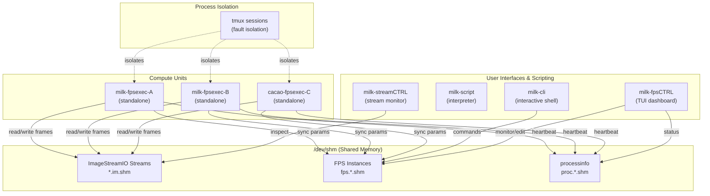

---
tags:
  - developer-guide
  - architecture
  - c-api
---

# Programmer's Guide to `milk`

Welcome to `milk`. This document serves as an overview of its core architecture and programming model. If you are reading this while setting up a new module, debugging, or wanting to write a custom module, this guide will orient you on the core concepts.

## 1. Core Architecture

`milk` is structured around decoupled, high-performance
computing components. Instead of monolithic structures, it
relies on small modular units ("compute units") talking to
each other via standard inter-process communication
mechanisms.

The architecture orbits around two primary concepts:

1. **ImageStreamIO (Streams):**
   - The primary data layer. Shared memory images/data
     cubes are passed around with near-zero copy overhead.
     Stream metadata holds dimensions, data format,
     keywords, and synchronization semaphores that trigger
     downstream processes.

2. **Function Processing System (FPS):**
   - The control and parameter layer. FPS manages
     configuration parameters, state, and commands for
     compute units. FPS instances reside in shared memory
     (`/dev/shm/fps.*`), allowing for real-time adjustments
     via the CLI, GUI, or other automated processes without
     restarting the compute module itself.



## 2. Process Management

`milk` isolates its execution environments utilizing `tmux` and its own framework:

- **Isolated Execution:** When an FPS script is launched via a standalone program (e.g., `milk-fps-deploy` or via the `milk-fpsexec-<name>` executables), `milk` places these instances inside dedicated `tmux` sessions. This ensures that failures in one component do not drag down the whole system, while maintaining accessibility for debugging standard error/output.
- **Processinfo (`procinfo`):** Every FPS instance tracks its heartbeat, state (idle, computing, waiting), loops per second, and error conditions in the system. The `milk-procinfo-list` command depends on these heartbeat counters properly updating.

## 3. Writing a Compute Unit

When building a new compute task, `milk` enforces a standardized "V2" format. The canonical template is `src/milk_module_example/examplefunc_fps_cli_poc.c`.

### Step-by-Step

1. **Copy the template**: Use `examplefunc_fps_cli_poc.c` as your starting point.

2. **Update identity** (section 1 — `FPS_APP_INFO`):
   - `.fps_name` — SHM name on disk (no spaces)
   - `.cmdkey` — CLI keyword
   - `.description` — one-line summary (shown by `-h1`)

3. **Define parameters** (sections 2–3):
   - Add local C variables in section 2
   - Map them in the `FPS_PARAMS` X-macro in section 3
   - Use `char*` for string-type params; pass `&ptr` in the X-macro
   - Use `&variable` for scalars

4. **Implement logic** (section 4 — `fpsexec()`):
   - Pure computation; parameters are already synced

5. **Add CMake targets**: In your module's `CMakeLists.txt`:

   ```cmake
   # Shared library (for milk CLI usage)
   add_library(${LIBNAME} SHARED ${SRCNAME}.c ${SOURCEFILES})
   target_link_libraries(${LIBNAME} PRIVATE CLIcore)

   # Standalone executable (1 line per exe!)
   add_milk_standalone(myfunction myfunction.c)
   # For cacao plugins:
   add_cacao_standalone(myfunc myfunction.c)
   # If the standalone uses plugin compute functions:
   add_cacao_standalone_plugins(myfunc myfunction.c)          # all 4 plugins
   add_cacao_standalone_plugins(myfunc myfunction.c fft)       # only fft
   add_cacao_standalone_plugins(myfunc myfunction.c fft imagegen) # fft + imagegen
   # Valid plugin names: fft, imagegen, imagefilter, imagebasic
   ```

### The 8-Section Layout

1. **`FPS_APP_INFO`:** Registration of metadata (name, command keyword, description).
2. **Local parameters:** Definition of C variables.
3. **`FPS_PARAMS` (X-macro):** Maps C variables to FPS shared memory parameters.
4. **Compute Function (`fpsexec()`):** Pure calculation core.
5. **`CLIcmddata`:** CLI registry scoping.
6. **Compute wrapper:** Processinfo loop via `INSERT_STD_PROCINFO_COMPUTEFUNC_*` macros.
7. **Module registration:** `CLIADDCMD_*` function for CLI mode (guarded by `#ifndef FPS_STANDALONE`).
8. **Standalone `main()`:** `FPS_MAIN_STANDALONE_V2` macro handles FPS lifecycle, `-h1`, `-tmux`.

## 4. Directory Map

- `src/engine/`: Core daemon logic, including `ImageStreamIO` (shared-memory data), `libfps` (FPS core library), `libprocessinfo`, and `libmilkdata`.
- `src/cli/`: User interfaces and scripting layer, including `libmilkscript` (core interpreter), `CLIcore` (interactive shell), and `streamCTRL`.
- `src/milk_module_example`: Compute unit templates (start here!).
- `src/coremods/COREMOD_*/`: Core computation libraries (tools, iofits, arith, memory).
- `plugins/milk-extra-src/`: General plugin modules (fft, linalgebra, image processing...).
- `plugins/cacao-src/`: Cacao AO loop modules.
- `docs/`: Documentation.

### Standalone Executables vs Core Modules

`milk` provides both an interactive prompt (`milk-cli`) and independent executable programs known as standalone executables (`milk-fpsexec-*` and `cacao-fpsexec-*`).
Standalones are specifically designed to execute one compute unit in isolation without relying on the broader CLI environment, linking securely to only the `_compute` variants of libraries. They act as native Linux processes managed via `tmux` and `fpsCTRL`.

!!! tip
    **Writing a custom plugin?** See [plugins.md](developer/plugins.md) for a complete guide on how to integrate custom plugins into the build system.

## 5. Dependency Architecture

<details markdown="1">
<summary><b>Header Hierarchy</b></summary>

Compute unit source files use conditional includes to support both CLI and standalone builds:

```c
#ifdef MILK_NO_CLI
#include "CLIcore_standalone.h"   /* stub types for standalone */
#else
#include "CLIcore.h"              /* full CLI types */
#endif
#include "fps.h"                  /* FPS types (always needed) */
```

| Header | Provides | When to use |
|--------|----------|-------------|
| `CLIcore.h` | CLICMDDATA, CMDARGTOKEN, INSERT_STD macros, module registration | Dual-mode files (CLI + standalone) |
| `CLIcore_standalone.h` | Stub types, static inline no-ops | Auto-selected when `MILK_NO_CLI` is defined |
| `fps.h` | FPS types, X-macro expanders, FPS_MAIN_STANDALONE_V2 | Always needed for FPS compute units |
| `libmilkdata/milkdata.h` | IMGID, imageID, dcimg, dcnimg | Compute-only files that work with images |
| `milkDebugTools.h` | PRINT_ERROR, DEBUG_TRACE* | Compute-only files that use debug macros |

</details>

<details markdown="1">
<summary><b>Library Link Patterns — Dual Architecture</b></summary>

The build system maintains two library variants
for each module:

| Variant | Suffix | Compiled with | Linked by |
|---------|--------|--------------|----------|
| Full | `.so` | *(default)* | `milk-cli`, module `.so` |
| Compute-only | `_compute.so` | `MILK_NO_CLI` | `fpsexec` standalones |

`_compute` variants contain pure computation code
with no CLI registration. This keeps standalones
free of CLIcore dependencies.

When `USE_STATIC_LTO=ON`, a third variant is
built — static archives (`.a`) of the same
compute-only code:

| Variant | File | Purpose |
|---------|------|---------|
| Dynamic compute | `_compute.so` | Default fpsexec link |
| Static compute | `_compute.a` | LTO-optimized fpsexec link |

With static archives, GCC's LTO can inline and
optimize across all library boundaries. See
[PGO & LTO](pgo.md) for details.

**CMake standalone helpers:**

| CMake function | Links | Use for |
|----------------|-------|---------|
| `add_milk_standalone()` | COREMOD _compute libs, milkfps, milkdata, ImageStreamIO | milk-fpsexec-* executables |
| `add_cacao_standalone()` | Same as above | cacao-fpsexec-* (no plugin deps) |
| `add_cacao_standalone_plugins()` | Above + selected plugin _compute libs | cacao-fpsexec-* that use plugin functions |

**💡 Tip:** Use `_compute` variants of libraries
(e.g. `milkstatistic_compute`) when linking standalone
executables. The `_compute` variants never pull in
CLIcore.

</details>

<details markdown="1">
<summary><b>Compile-Time Guards</b></summary>

| Macro | Set by | Effect |
|-------|--------|--------|
| `MILK_NO_CLI` | CMake (`-DMILK_NO_CLI`) | Excludes CLI registration code, uses `CLIcore_standalone.h` |
| `FPS_STANDALONE` | CMake (`-DFPS_STANDALONE`) | Includes `main()` via `FPS_MAIN_STANDALONE_V2` |
| `USE_CLI` | CMake option | Controls whether CLI targets are built |

</details>

### Verifying Dependencies

Run `milk-check-standalone-deps` to verify no standalone accidentally links CLIcore.
It is also integrated as a CTest (`standalone-dep-check`) and runs automatically with
`ctest` in the build directory. 14 standalones are whitelisted as known exceptions
(they require module-lib symbols for OpenBLAS, FFT, etc.).

## 6. CMakeLists.txt Conventions

Use `src/milk_module_example/CMakeLists.txt` as the template
for new modules.

<details markdown="1">
<summary><b>Standard CMakeLists.txt layout</b></summary>

```text
## ═══════════════════════════════════════
##  module_name — Short description
## ═══════════════════════════════════════

set(LIBNAME ...)

## ── Source files ─────────────────────
set(SOURCEFILES ...)

## ── Library ──────────────────────────
add_library(${LIBNAME} ...)

## ── Compute-only variant ─────────────
## (if applicable)
set(LIBNAME_COMPUTE ...)

## ── Standalone executables ───────────
add_milk_standalone(...)

## ── Tests ────────────────────────────
add_test(...)
```

**Key rules:**

- Comment each source file in `SOURCEFILES` if it is also a standalone (dual-mode)
- Place `target_link_libraries()` calls directly below the `add_*_standalone()` they modify
- Keep lines ≤ 80 characters; split long `target_link_libraries` across lines

</details>

<details markdown="1">
<summary><b>Standalone helper functions</b></summary>

Defined in `cmake/MilkStandalone.cmake` (included by root CMakeLists):

| Function | Creates | Plugin deps |
|----------|---------|-------------|
| `add_milk_standalone(name src)` | `milk-fpsexec-name` | None |
| `add_cacao_standalone(name src)` | `cacao-fpsexec-name` | None |
| `add_cacao_standalone_plugins(name src [p…])` | `cacao-fpsexec-name` | Selected |

</details>

## 7. C Source File Conventions

<details markdown="1">
<summary><b>File header template</b></summary>

Every `.c` file should start with a kernel-doc header:

```c
/**
 * @file    filename.c
 * @brief   One-line description
 *
 * Longer description of algorithm, approach,
 * and key design choices.
 */
```

</details>

<details markdown="1">
<summary><b>Dual-mode files</b></summary>

Files compiled both as part of a shared library (CLI mode)
and as standalone executables use conditional includes:

```c
#ifdef MILK_NO_CLI
#include "CLIcore_standalone.h"
#else
#include "CLIcore.h"
#endif
#include "fps.h"
```

</details>

<details markdown="1">
<summary><b>Function documentation</b></summary>

Document functions with kernel-doc style above the function
body in `.c` files:

```c
/**
 * compute_response_matrix() - Build response matrix
 * @n_modes:   Number of modes to probe
 * @amp:       Probe amplitude [DM units]
 *
 * Measures WFS response to each DM mode by applying
 * positive and negative pokes and averaging.
 *
 * Return: 0 on success, -1 on error
 */
```

</details>

<details markdown="1">
<summary><b>Module README</b></summary>

Each module directory should have a `README.md` with:

- One-line purpose
- Table of source files with descriptions
- Table of standalone executables (if any)
- External dependencies

</details>

***


*(This guide is automatically updated by your coding agent using the [/update-programmers-guide](https://github.com/milk-org/milk/blob/framework-dev/.agents/workflows/update-programmers-guide.md) workflow)*


***
← [Documentation Index](index.md)
