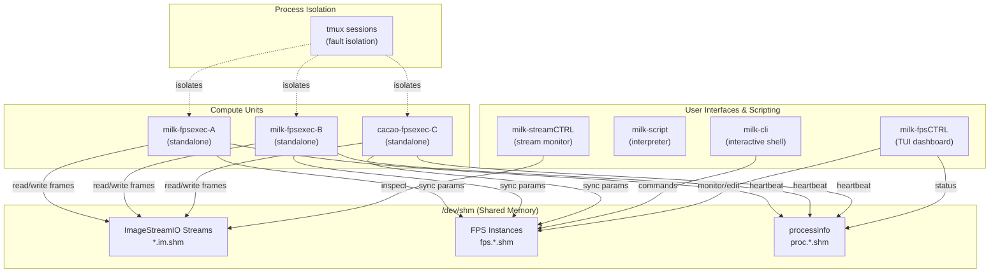

---
tags:
  - developer-guide
  - architecture
  - c-api
---

# Programmer's Guide to `milk`

Welcome to `milk`. This document serves as an overview of its core architecture and programming model. If you are reading this while setting up a new module, debugging, or wanting to write a custom module, this guide will orient you on the core concepts.

## 1. Core Architecture

`milk` is structured around decoupled, high-performance
computing components. Instead of monolithic structures, it
relies on small modular units ("compute units") talking to
each other via standard inter-process communication
mechanisms.

The architecture orbits around two primary concepts:

1. **ImageStreamIO (Streams):**
   - The primary data layer. Shared memory images/data
     cubes are passed around with near-zero copy overhead.
     Stream metadata holds dimensions, data format,
     keywords, and synchronization semaphores that trigger
     downstream processes.

2. **Function Processing System (FPS):**
   - The control and parameter layer. FPS manages
     configuration parameters, state, and commands for
     compute units. FPS instances reside in shared memory
     (`/dev/shm/fps.*`), allowing for real-time adjustments
     via the CLI, GUI, or other automated processes without
     restarting the compute module itself.


```mermaid
graph TD
    subgraph "User Interfaces & Scripting"
        CLI["milk-cli<br/>(interactive shell)"]
        SCRIPT["milk-script<br/>(interpreter)"]
        TUI["milk-fpsCTRL<br/>(TUI dashboard)"]
        SCTRL["milk-streamCTRL<br/>(stream monitor)"]
    end

    subgraph "/dev/shm (Shared Memory)"
        SHM["ImageStreamIO Streams<br/>*.im.shm"]
        FPSSHM["FPS Instances<br/>fps.*.shm"]
        PINFO["processinfo<br/>proc.*.shm"]
    end

    subgraph "Compute Units"
        SA["milk-fpsexec-A<br/>(standalone)"]
        SB["milk-fpsexec-B<br/>(standalone)"]
        SC["cacao-fpsexec-C<br/>(standalone)"]
    end

    subgraph "Process Isolation"
        TMUX["tmux sessions<br/>(fault isolation)"]
    end

    SA -- "read/write frames" --> SHM
    SB -- "read/write frames" --> SHM
    SC -- "read/write frames" --> SHM
    SA -- "sync params" --> FPSSHM
    SB -- "sync params" --> FPSSHM
    SC -- "sync params" --> FPSSHM
    SA -- "heartbeat" --> PINFO
    SB -- "heartbeat" --> PINFO
    SC -- "heartbeat" --> PINFO

    CLI -- "commands" --> FPSSHM
    TUI -- "monitor/edit" --> FPSSHM
    TUI -- "status" --> PINFO
    SCTRL -- "inspect" --> SHM

    TMUX -. "isolates" .-> SA
    TMUX -. "isolates" .-> SB
    TMUX -. "isolates" .-> SC
```

## 2. Process Management

`milk` isolates its execution environments utilizing `tmux` and its own framework:

- **Isolated Execution:** When an FPS script is launched via a standalone program (e.g., `milk-fps-deploy` or via the `milk-fpsexec-<name>` executables), `milk` places these instances inside dedicated `tmux` sessions. This ensures that failures in one component do not drag down the whole system, while maintaining accessibility for debugging standard error/output.
- **Processinfo (`procinfo`):** Every FPS instance tracks its heartbeat, state (idle, computing, waiting), loops per second, and error conditions in the system. The `milk-procinfo-list` command depends on these heartbeat counters properly updating.

## 3. Writing a Compute Unit

When building a new compute task, `milk` enforces a standardized "V2" format. The canonical template is `src/milk_module_example/examplefunc_fps_cli_poc.c`.

### Step-by-Step

1. **Copy the template**: Use `examplefunc_fps_cli_poc.c` as your starting point.

2. **Update identity** (section 1 — `FPS_APP_INFO`):
   - `.fps_name` — SHM name on disk (no spaces)
   - `.cmdkey` — CLI keyword
   - `.description` — one-line summary (shown by `-h1`)

3. **Define parameters** (sections 2–3):
   - Add local C variables in section 2
   - Map them in the `FPS_PARAMS` X-macro in section 3
   - Use `char var[FUNCTION_PARAMETER_STRMAXLEN]` for string-type params; pass `var` directly
   - Use `&variable` for scalars

4. **Implement logic** (section 4 — `fpsexec()`):
   - Pure computation; parameters are already synced

5. **Add CMake targets**: In your module's `CMakeLists.txt` (see [§6](#6-cmakeliststxt-conventions)), add one line per executable:

   ```cmake
   add_milk_standalone(myfunction myfunction.c)
   # For cacao plugins:
   add_cacao_standalone(myfunc myfunction.c)
   # If the standalone uses plugin compute functions:
   add_cacao_standalone_plugins(myfunc myfunction.c)          # all 4 plugins
   add_cacao_standalone_plugins(myfunc myfunction.c fft)       # only fft
   add_cacao_standalone_plugins(myfunc myfunction.c fft imagegen) # fft + imagegen
   # Valid plugin names: fft, imagegen, imagefilter, imagebasic
   ```

### The 8-Section Layout

1. **`FPS_APP_INFO`:** Registration of metadata (name, command keyword, description).
2. **Local parameters:** Definition of C variables.
3. **`FPS_PARAMS` (X-macro):** Maps C variables to FPS shared memory parameters.
4. **Compute Function (`fpsexec()`):** Pure calculation core.
5. **`CLIcmddata`:** CLI registry scoping.
6. **Compute wrapper:** Processinfo loop via `INSERT_STD_PROCINFO_COMPUTEFUNC_*` macros.
7. **Module registration:** `CLIADDCMD_*` function for CLI mode (guarded by `#if !defined(FPS_STANDALONE) && !defined(MILK_NO_CLI)`).
8. **Standalone `main()`:** `FPS_MAIN_STANDALONE_V2` (or `_V2_CONFCHECK` if a `customCONFcheck` is needed) handles FPS lifecycle, `-h1`, `-tmux`.

## 4. Directory Map

- `src/engine/`: Core daemon logic, including `ImageStreamIO` (shared-memory data), `libfps` (FPS core library), `libfpsseq` (FPS sequencer), `libmilkcommon` (common utilities, debug tools), `libprocessinfo`, and `libmilkdata`.
- `src/cli/`: User interfaces and scripting layer, including `libmilkscript` (core interpreter), `CLIcore` (interactive shell), `overview` (system overview TUI), and `streamCTRL`.
- `src/milk_module_example`: Compute unit templates (start here!).
- `src/coremods/COREMOD_*/`: Core computation libraries (tools, iofits, arith, memory).
- `plugins/milk-extra-src/`: General plugin modules (fft, linalgebra, image processing...).
- `plugins/cacao-src/`: Cacao AO loop modules (user-created symlink to `~/src/cacao`; not present on a fresh clone).
- `docs/`: Documentation.

### Standalone Executables vs Core Modules

`milk` provides both an interactive prompt (`milk-cli`) and independent executable programs known as standalone executables (`milk-fpsexec-*` and `cacao-fpsexec-*`).
Standalones are specifically designed to execute one compute unit in isolation without relying on the broader CLI environment. They act as native Linux processes managed via `tmux` and `fpsCTRL`.

!!! tip
**Writing a custom plugin?** See [plugins.md](developer/plugins.md) for a complete guide on how to integrate custom plugins into the build system.

## 5. Dependency Architecture

### Header Hierarchy

Compute unit source files use conditional includes to support both CLI and standalone builds:

```c
#ifdef MILK_NO_CLI
#include "CLIcore_standalone.h"   /* stub types for standalone */
#else
#include "CLIcore.h"              /* full CLI types */
#endif
#include "fps.h"                  /* FPS types (always needed) */
```

| Header                   | Provides                                             | When to use                                 |
| ------------------------ | ---------------------------------------------------- | ------------------------------------------- |
| `CLIcore.h`              | CLICMDDATA, CMDARGTOKEN, INSERT_STD macros           | Dual-mode files (CLI + standalone)          |
| `CLIcore_standalone.h`   | Stub types, static inline no-ops                     | Auto-selected when `MILK_NO_CLI` is defined |
| `fps.h`                  | FPS types, X-macro expanders, FPS_MAIN_STANDALONE_V2 | Always needed for FPS compute units         |
| `libfps/IMGID.h`         | IMGID struct, imgid_make\*, imgid_connect            | Compute-only files that work with images    |
| `libmilkdata/milkdata.h` | MILK_DATA struct, milk_data_init                     | Core data arrays, RNG, global state         |
| `milkDebugTools.h`       | imageID typedef, PRINT_ERROR, DEBUG_TRACE\*          | Compute-only files that use debug macros    |

</details>

### Library Link Patterns

Each module builds a single regular library, shared by `milk-cli` and standalone executables alike. `MILK_NO_CLI`, applied to the `fpsexec` target, redirects `CLIcore.h` to the lightweight `CLIcore_standalone.h` stub for that executable's translation units.

??? note "Details"
    For CLI execution of a CU:
    ```text
    # CLI linkage
    milk-cli / milk-script
        └-> Custom loading of <module>.so\
            └-> RegisterModule() [from CLIcore.c]
                └-> init_module_CLI() [from <module>.so, via MILK_MODULE passing the function pointer]
            └-> RegisterCLICommand() [from CLIcore.c]
            └-> CLIfunction() [from <module>.so]\
                └-> Prepares the calling context
                └-> compute_function(), via a function pointer.
    ```
    And for `fpsexec` execution:
    ```text
    milk-fpsexec-<myfunc>
        └-> Automatic loading of <module>.so as a dependency.
        |   # init_module_CLI(), RegisterCLICommand() etc. may exist (-DUSE_CLI=ON) but are NOT invoked.
        └-> Invokes `main()`
            └-> Invokes `main_impl()`
                └-> prepares a statically defined calling context.
                └-> compute_function() of <myfunc>, via a function pointer.
    ```


When `USE_STATIC_LTO=ON`, standalone executables instead link `_static`-suffixed static archives (e.g. `milkCOREMODmemory_static`) of the same libraries, letting GCC's LTO inline and optimize across library boundaries. See [PGO & LTO](pgo.md) for details.

**CMake standalone helpers:**

| CMake function                   | Links                                          | Use for                                    |
| -------------------------------- | ---------------------------------------------- | ------------------------------------------ |
| `add_milk_standalone()`          | COREMOD libs, milkfps, milkdata, ImageStreamIO | milk-fpsexec-\* executables                |
| `add_cacao_standalone()`         | Same as above                                  | cacao-fpsexec-\* (no plugin deps)          |
| `add_cacao_standalone_plugins()` | Above + selected plugin libs                   | cacao-fpsexec-\* that use plugin functions |

`add_milk_standalone()` / `add_cacao_standalone()` apply `-DMILK_NO_CLI` and link the common library set automatically; add a per-module library explicitly only if the executable calls a module-specific function.

</details>

<details markdown="1">
<summary><b>Compile-Time Guards</b></summary>

| Macro            | Set by                     | Effect                                                      |
| ---------------- | -------------------------- | ----------------------------------------------------------- |
| `MILK_NO_CLI`    | CMake (`-DMILK_NO_CLI`)    | Excludes CLI registration code, uses `CLIcore_standalone.h` |
| `FPS_STANDALONE` | CMake (`-DFPS_STANDALONE`) | Includes `main()` via `FPS_MAIN_STANDALONE_V2`              |
| `USE_CLI`        | CMake option               | Controls whether CLI targets are built                      |

</details>

### Verifying Dependencies

Run `milk-check-standalone-deps` to verify no standalone accidentally links CLIcore.
It is also integrated as a CTest (`standalone-dep-check`) and runs automatically with
`ctest` in the build directory. 14 standalones are whitelisted as known exceptions
(they require module-lib symbols for OpenBLAS, FFT, etc.).

## 6. CMakeLists.txt Conventions

`src/milk_module_example/CMakeLists.txt` is the reference for every module under
`src/coremods/`, `src/milk_module_example/` and `plugins/`. Copy it and rename.

<details markdown="1">
<summary><b>Standard CMakeLists.txt skeleton</b></summary>

```cmake
set(LIBNAME "mymodule") # lib${LIBNAME}.so
set(SRCNAME "mymodule") # main module source: ${SRCNAME}.c

# Sources are globbed; keep auxiliaries in an internal/ subfolder.
file(GLOB SOURCEFILES "*.c")
file(GLOB INCLUDEFILES "*.h")
file(GLOB SCRIPTS "scripts/*") # installed to bin/

project(lib_${LIBNAME}_project)

include_directories("${PROJECT_SOURCE_DIR}/src")
include_directories("${PROJECT_SOURCE_DIR}/..")

add_library(${LIBNAME} SHARED ${SOURCEFILES})
target_include_directories(
  ${LIBNAME} PRIVATE $<TARGET_PROPERTY:CLIcore,INTERFACE_INCLUDE_DIRECTORIES>)

# Resolves MILK_CMAKE_REQUEST / MILK_CMAKE_MANDATE and applies linkage.
milk_apply_extensions(${LIBNAME})

install(
  TARGETS ${LIBNAME}
  EXPORT milkTargets
  DESTINATION lib)
install(FILES ${INCLUDEFILES} DESTINATION include/${SRCNAME})
install(PROGRAMS ${SCRIPTS} DESTINATION bin)

# One line per standalone: single source file, built with -DFPS_STANDALONE.
add_milk_standalone(myfunc myfunc.c)

# Link ${LIBNAME} into every standalone of this directory.
get_property(_stdalones DIRECTORY ${CMAKE_CURRENT_SOURCE_DIR}
  PROPERTY BUILDSYSTEM_TARGETS)
foreach(_t IN LISTS _stdalones)
  get_target_property(_type ${_t} TYPE)
  if(_type STREQUAL "EXECUTABLE")
    target_link_libraries(${_t} PUBLIC ${LIBNAME})
  endif()
endforeach()

add_test(NAME mymodule-myfunc-h1 COMMAND milk-fpsexec-myfunc -h1)
```

**Key rules:**

- Plugins under `plugins/` are discovered automatically; no parent `CMakeLists.txt` edit is needed.
- Express optional dependencies with the `MILK_CMAKE_REQUEST_<X>` / `MILK_CMAKE_MANDATE_<X>` tags (see [Managing Dependencies](developer/dependency_system.md)); do not hand-write include or link rules.
- Each module installs only its own headers.
- Keep lines ≤ 80 characters.

</details>

<details markdown="1">
<summary><b>Standalone helper functions</b></summary>

Defined in `cmake/milk_standalone.cmake` (included by root CMakeLists):

| Function                                      | Creates              | Plugin deps |
| --------------------------------------------- | -------------------- | ----------- |
| `add_milk_standalone(name src)`               | `milk-fpsexec-name`  | None        |
| `add_cacao_standalone(name src)`              | `cacao-fpsexec-name` | None        |
| `add_cacao_standalone_plugins(name src [p…])` | `cacao-fpsexec-name` | Selected    |

</details>

## 7. C Source File Conventions

<details markdown="1">
<summary><b>File header template</b></summary>

Every `.c` file should start with a kernel-doc header:

```c
/**
 * @file    filename.c
 * @brief   One-line description
 *
 * Longer description of algorithm, approach,
 * and key design choices.
 */
```

</details>

<details markdown="1">
<summary><b>Dual-mode files</b></summary>

Files compiled both as part of a shared library (CLI mode)
and as standalone executables use conditional includes:

```c
#ifdef MILK_NO_CLI
#include "CLIcore_standalone.h"
#else
#include "CLIcore.h"
#endif
#include "fps.h"
```

</details>

<details markdown="1">
<summary><b>Function documentation</b></summary>

Document functions with kernel-doc style above the function
body in `.c` files:

```c
/**
 * compute_response_matrix() - Build response matrix
 * @n_modes:   Number of modes to probe
 * @amp:       Probe amplitude [DM units]
 *
 * Measures WFS response to each DM mode by applying
 * positive and negative pokes and averaging.
 *
 * Return: 0 on success, -1 on error
 */
```

</details>

<details markdown="1">
<summary><b>Module README</b></summary>

Each module directory should have a `README.md` with:

- One-line purpose
- Table of source files with descriptions
- Table of standalone executables (if any)
- External dependencies

</details>

---

_(This guide is automatically updated by your coding agent using the [/update-programmers-guide](https://github.com/milk-org/milk/blob/framework-dev/.agents/workflows/update-programmers-guide.md) workflow)_

---

← [Documentation Index](index.md)
