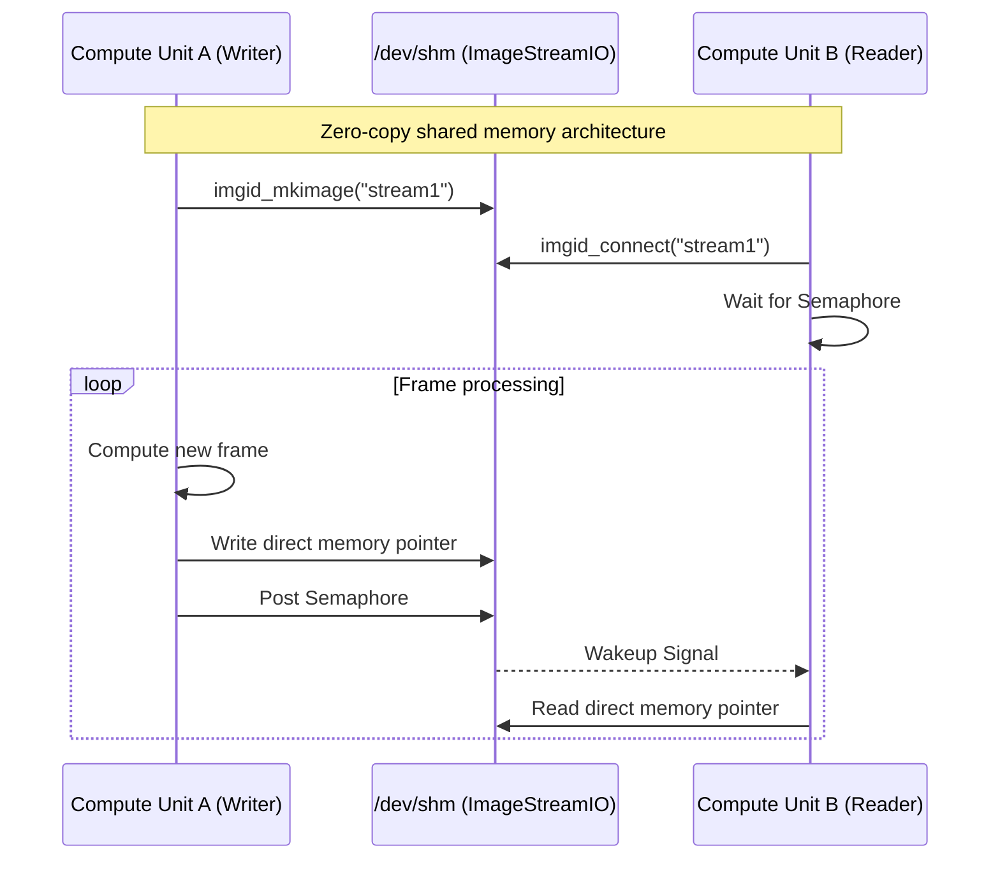

---
tags:
  - streams
  - imagestreamio
  - zero-copy
  - shared-memory
---

# Shared Memory Streams (`ImageStreamIO`)

`milk` is built around a low-latency, zero-copy architecture
designed for high-performance pipelines. This core feature is
powered by `ImageStreamIO` which allocates streams
(n-dimensional tensors, typically images or data cubes)
directly in the Linux tmpfs (`/dev/shm/`).

See also: [FPS](fps.md) ·
[Process Info](procinfo.md) ·
[CLI Reference](cli/CLIcore.md) ·
[Scripts Reference](scripts.md)

## 1. Core Concepts

Unlike file-system-based intermediate data passing,
`ImageStreamIO` provides direct memory pointers to running
compute units. Processes can read from or write to the same
stream with microsecond latencies.



## 2. Metadata and Semaphores

Every stream contains more than just pixel values. It
includes a comprehensive metadata header:

1. **Dimensionality:** Size and shape axes (1D arrays to
   3D cubes).
2. **Data Types:** Support for signed/unsigned integers
   and floating point up to 64-bit precision.
3. **Keywords:** An embedded dictionary of FITS-style
   keywords to propagate state (e.g., exposure parameters
   or telemetry data).
4. **Semaphores:** POSIX semaphores are bound natively to
   streams. When a compute unit finishes writing a frame,
   it posts a semaphore. Downstream processes blocking on
   that stream immediately wake up, ensuring synchronized
   cascading pipelines.

## 3. Stream Modifiers

When interacting with streams on the CLI or within `milk`
algorithms, standard modifiers are supported directly
inside the stream string. E.g. passing `myImage@L:` to a
module.

- `@S:` (Shared): Expected to reside in `/dev/shm/`.
  This is the default if no modifier is given.
- `@L:` (Local): Allocated in private local process
  memory. Used for internal buffering that doesn't need
  to be visible externally.
- `@F:` (File / FITS): Bypasses shared memory to directly
  read a physical file on disk.
- `@E:` (Exists): The stream must already exist.
  Returns an error if not found.
- `@N:` (New): The stream must **not** exist.
  Returns an error if it already exists.

Modifiers are composable: `@LE:name` means "local
memory, must exist".

*When writing modules using `fpsexec` patterns, passing
a non-existent or disallowed modifier automatically alerts
the user and aborts the module spin-up to prevent silent
failures.*

### Legacy `>` Prefixes

Older code may use `>` as a separator for inline
creation hints embedded in the stream name string:

| Prefix | Example | Effect |
|--------|---------|--------|
| `t...>` | `tf32>im1` | Set data type (float32) |
| `k...>` | `k10>im1` | Set keyword count |
| `c...>` | `c20>im1` | Set circular buffer size |

These are parsed by `imgid_make_from_name()` and
remain supported.

> [!NOTE]
> The `s>` prefix (shared memory) has been **removed**.
> It was redundant with the default behavior
> (shared memory is always the default). Use `@S:` for
> explicit shared-memory annotation if needed.


## 4. Introspection

Tools like `milk-streamCTRL` provide real-time
introspection into active streams, displaying frame
arrival rates, recent values, and the current state of
semaphores without disrupting operations.

## 5. C API (`IMGID`)

`milk` uses the `IMGID` structure to hold references to
images and streams. This structure is one level above
`ImageStreamIO`, and is local to the `milk` process. It is
the preferred way to pass images and streams as function
arguments.

=== "Create"

    Creating a blank `IMGID` (does not allocate memory yet):

    ```c
    static inline IMGID imgid_make()
    ```

    Creating an `IMGID` with a name:

    ```c
    static inline IMGID imgid_make_from_name(
        CONST_WORD name
    )
    ```

    Creating a new stream in shared memory:

    ```c
    IMGID img = imgid_make_from_name("im1");
    img.naxis = 2;
    img.size[0] = 128;
    img.size[1] = 128;
    img.shared = 1; // 1 = SHM, 0 = local

    imgid_mkimage(&img);

    // When done:
    imgid_free(&img);
    ```

=== "Connect"

    Connect to an existing stream:

    ```c
    IMGID img1 = imgid_make();
    imgid_connect("streamname1", &img1, 0);
    if (img1.ID == -1) {
        // handle failure
    }
    ```

    Name prefixes like `tf32>im1` set the data type
    automatically. Use `@S:` / `@L:` modifiers for
    location control (see section 3 above).

=== "Format-checked"

    Ensure the stream has specific dimensions, or create it
    if it doesn't match:

    ```c
    IMGID img1 = imgid_make();
    img1.naxis = 2;
    img1.size[0] = 128;
    img1.size[1] = 128;

    // Create if format is wrong or doesn't exist
    imgid_connect("streamname1", &img1,
        IMGID_CONNECT_CHECK_CREATE);
    ```

    Typed convenience function:

    ```c
    // Force 2D float32 creation/connection
    imgid_connect_create_2Df32(
        "streamname1", &img1, xsize, ysize
    );
    ```

!!! tip
    Functions should prefer passing parameters using
    `IMGID` pointers and accessing pixels through
    `img.im->array.F` or similar data type unions based
    on `img.im->md[0].datatype`.

---
← [Documentation Index](index.md)
